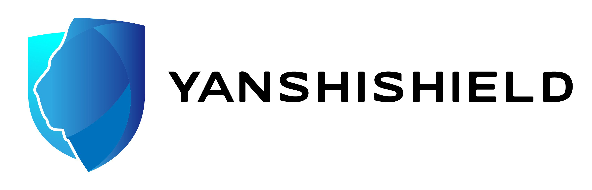

# YanshiSheild-FL

[中文](README_zh.md)

**Yanshi Sheild** is an open source community that focuses on AI Security and Safety, among which **Yanshi Sheild FL** as a sub project of YanshiSheild, provides federated learning solutions. Its objective is to boost the security and safety of AI systems in the fields of AI security detection and evaluation, AI security reinforcement, AI fairness detection and evaluation, AI fairness improvement, and AI interpretation. It can be uesed for computer software consultancy, research in the field of artificial intelligence and telecommunication network security consulting. Federated learning is a privacy preserving machine learning method that utilizes a large number of decentralized data remaining on client devices collaborates to complete the training of machine learning models. The goal of YanshiSheild FL is to create a reliable, efficient, easy-to-use federated learning and federated computing platform under the premise of privacy and security. YanshiSheild-FL features the following:

* Use cryptographic algorithms such as differential privacy, multi-party secure computing (MPC) and homomorphic encryption to ensure privacy and the security of intermediate data.
* Provide a variety of federated aggregation algorithms to ensure the convergence and convergence efficiency of the model under different data distributions.
* Provide a low-cost migration solution from existing machine learning to federation, currently supports Pytorch, Tensorflow/Keras

## Getting Started

### Build

YanshiSheild FL support two installation modes, the minimal installation mode of standalone and cluster mode based on Kubernetes, as follow:

- standalone mode:  In this mode, only federated training of a single job can be performed. During the training process, only the coordinator and clients of the job are required to participate, which is suitable for scenarios where you can quickly experience YanshiSheild FL or locally verify the correctness of the federated learning code.
- cluster mode: There are complete functions and features of YanshiSheild FL, such as job management and scheduling, client management and selection, etc.

System components in standalone mode support running as processes  or containers, while all components in cluster mode must run as containers. Please refer to the [Build](docs/build.md) document to select the correct build mode and required  YanshiSheild FL components.

### Install

See the [install](./docs/install.md)  documentation for YanshiSheild FL installation. YanshiSheild FL support install as standalone mode or cluster mode.

### Quick Start

See the [quick start](./docs/quick_start.md) documentation to learn how to use YanshiSheild FL for federated training, using standalone deployment mode in this example.

## Design and Interface

### Design

- [architecutrue](./docs/architecture.md)

### Algorithms

- [secure](./docs/algorithms/secure_algos.md)
- [aggregation](./docs/algorithms/aggregation_algos.md)

### Interface

- [Developer guide](./docs/develop.md)

## Contributing

We welcome all kinds of contributions, please refer to the [CONTRIBUTING](CONTRIBUTING.md) to get started.

