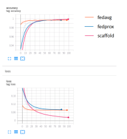
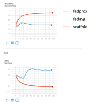
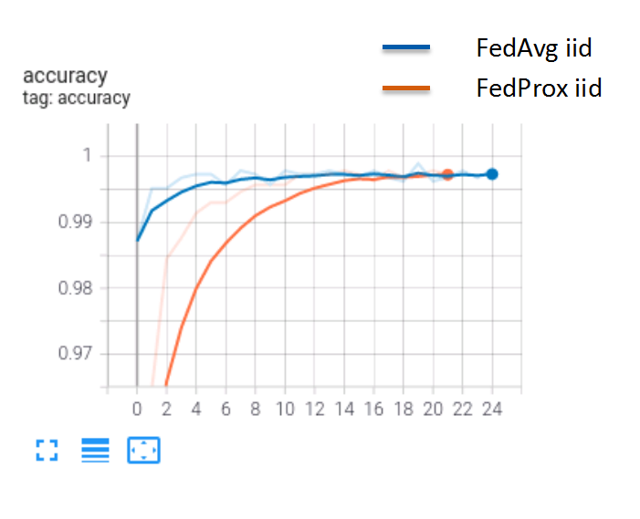
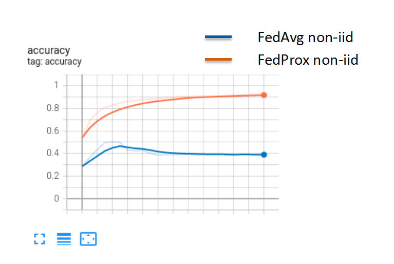
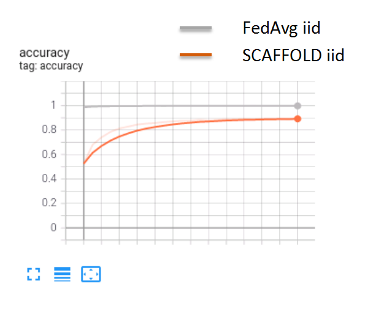
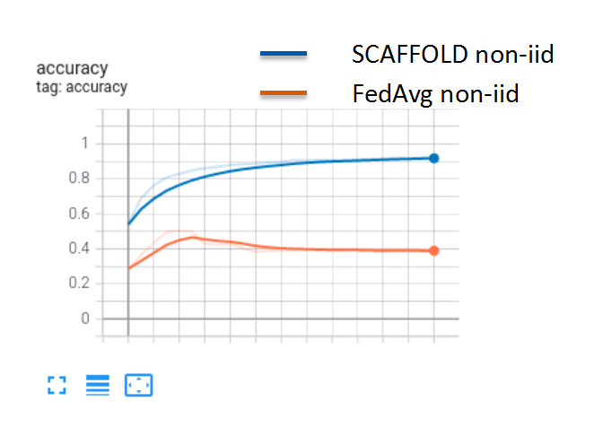
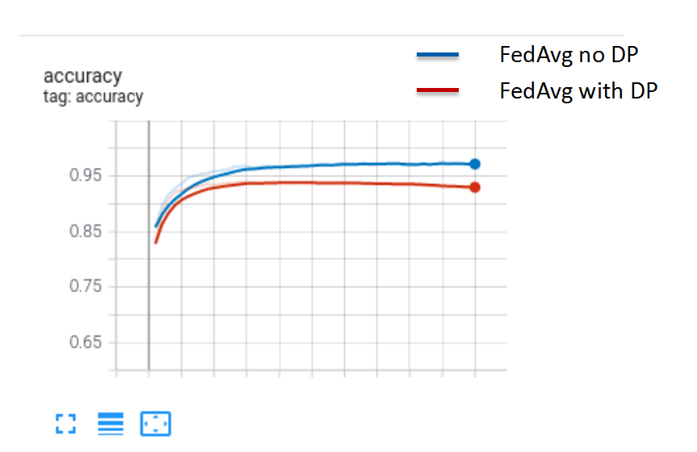
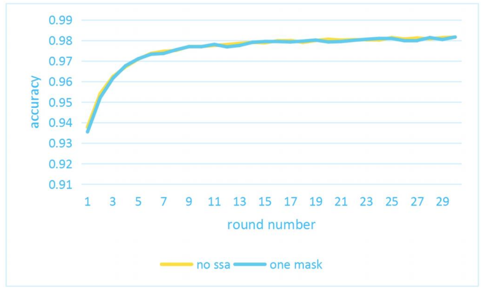

------

## Algorithms

Federated learning faces many challenges, such as data heterogeneity, privacy and security, fairness and other issues. For some of these problems, we have implemented some corresponding algorithms to solve them. This document will describe the usage and performances of these algorithms in detail.

**Optimizers**:

- [FedAvg](#fedavg)
- [FedProx](#fedprox)
- [SCAFFOLD](#scaffold)

**Security**:

- [Differential Privacy](#dp)
- [Secure Aggregation](#ssa)


### FedAvg

The federated average algorithm performs a weighted average of the model parameters updates of all clients participating in the training in this round, where the weight value is the proportion of the client samples to the total samples.

FedAvg Citing Paper: [Communication-Efficient Learning of Deep Networks from Decentralized Data](https://arxiv.org/pdf/1602.05629.pdf) 

Note: Federated average is one of the earliest proposed federated aggregation algorithms, which is the default standard aggregation algorithm in federated learning and can be used in most normal training situations. But in the face of data heterogeneity(non-IID), it may fails to converge.

#### How to use it

```
We use the FedAvg algorithm by default without any additional configuration.
```

#### Performances

We train on the [Flowers Recognition](https://www.kaggle.com/datasets/alxmamaev/flowers-recognition) dataset, and each client with an IID data distribution, the following figure is the convergence curve with comparison with other algorithms.

| IID                            | non-IID                        |
| ------------------------------ | ------------------------------ |
|  |  |


### FedProx

The FedProx algorithm limits the influence of local updates by adding correction terms on the local updates, so that the weights of the local model does not deviate from the global model.

FedProx Citing Paper: [FEDERATED OPTIMIZATION IN HETEROGENEOUS NETWORKS](https://arxiv.org/pdf/1812.06127.pdf)

Note: FedProx mainly tackle data heterogeneity in federated learning. It has stronger convergence and more stability on heterogeneous datasets.  In addition, it's a generalized form of FedAvg in essence, when the parameter $\mu$ is 0, the algorithm degenerates to FedAvg. It is very suitable for situations where the client participating in the has the heterogeneous data.

#### How to use it

You can use the FedProx aggregation algorithm by adding 'parameters' configuration to the job configuration file. For example:

```
"parameters": {
    "--optimizer": "fedprox",
    "--mu": 0.6
}
```

#### Performances

We train on the [Flowers Recognition](https://www.kaggle.com/datasets/alxmamaev/flowers-recognition) dataset, and test the federated training both under IID and non-IID respectively, the following figure is the convergence curve with comparison with FedAvg. Convergence will be slower in the IID case, but able to converge in the non-IID case

| IID                              | non-IID                          |
| -------------------------------- | -------------------------------- |
|  |  |


### SCAFFOLD

The SCAFFOLD algorithm introduce the global and local gradient corrections to correct the deviation caused by the non-IID sample data in the client. So the client's local weights will not deviate from the global weights too large.

SCAFFOLD Citing Paper: [SCAFFOLD: Stochastic Controlled Averaging for Federated Learning](https://arxiv.org/pdf/1910.06378.pdf)

Note: The algorithm also mainly solves the problem of data heterogeneous. The same convergence rate as FedAvg can be achieved even under non-IID. However, it is a stateful algorithm, which means that there are strict requirements for client stability and also system reliability, so it is not very suitable for Cross-Device scenarios.

#### How to use it

You can use the SCAFFOLD aggregation algorithm by adding a 'optimizer 'configuration to the job configuration file. For example:

```
"optimizer": {
    "name": "scaffold",
    "params": {}
}
```

#### Performances

We train on the [Flowers Recognition](https://www.kaggle.com/datasets/alxmamaev/flowers-recognition) dataset, and test the federated training both under IID and non-IID respectively, the following figure is the convergence curve with comparison with FedAvg. Likewise, it converges more slowly in the IID case, but is able to converges in the non-iid case.

| IID                                | non-IID                            |
| ---------------------------------- | ---------------------------------- |
|  |  |


### DP

Differential privacy (DP)  is a system for publicly sharing information about a dataset by describing the patterns of groups within the dataset while withholding information about individuals in the dataset. See [here](https://en.wikipedia.org/wiki/Differential_privacy) to learn more.

DP can be applied in many fields, in federated learning, we refer to:

- [Deep Learning with Differential Privacy](https://arxiv.org/pdf/1607.00133.pdf%20)
- [A General Approach to Adding Differential Privacy to Iterative Training Procedures](https://arxiv.org/pdf/1812.06210.pdf)

Federated learning introduces differential privacy to prevent attackers from performing reverse analysis on intermediate data (such as gradients, etc.) to obtain sample data. Typically, differential privacy achieves the purpose of privacy protection by adding noise to the data.  At the same time, the computational and transmission overhead is small. However,  Since noise is irreversible, it may affect training accuracy.

#### How to use it

You can use the DP for security by adding a 'secure_algorithm' configuration to the job configuration file. For example:

```
"secure_algorithm": {
    "type": "dp",
    "noise_multiplier": 1.0
}
```

See [here](./develop.md#securealgorithm) to learn more.

#### Performances

We train on the [Flowers Recognition](https://www.kaggle.com/datasets/alxmamaev/flowers-recognition) dataset, and found that DP has a little impact on accuracy, but could converge. The following figure is the convergence curve with comparison to no DP.

| IID(FedAvg)          |
| -------------------- |
|  |


### SSA

Secret Share Aggregation(SSA) is a way to use [Secret Share](https://en.wikipedia.org/wiki/Secret_sharing) to ensure data privacy. Firstly, use Secret Share to send the local secret key (mask) shard to each participant. Then in the federated aggregation process, the data reported by each client is encrypted by the local mask shard. Finally, in the server-side aggregation process, the mask is cancelled to obtain the aggregation result.

We refer to the paper: [Practical Secure Aggregation for Privacy-Preserving Machine Learning](https://eprint.iacr.org/2017/281.pdf) 

Note: SSA can face data privacy security issues in semi-honest scenarios and malicious scenarios, and the double mask mode can tolerate client disconnection, but it will lead to a significant increase in the amount of communication and computation. Therefore, different masking methods can be selected according to specific application scenarios to balance privacy and traffic.

#### How to use it

You can use the SSA for security by adding a 'secure_algorithm' configuration to the job configuration file. For example:

```
"secure_algorithm": {
    "type": "ssa",
    "threshold": 3
    "mode": "doublemask"
}
```

See [here](./develop.md#securealgorithm) to learn more.

#### Performances

| onemask                  | doublemask               |
| ------------------------ | ------------------------ |
|  |  |


