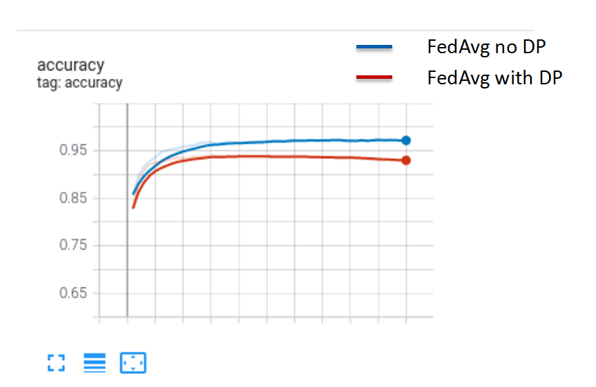
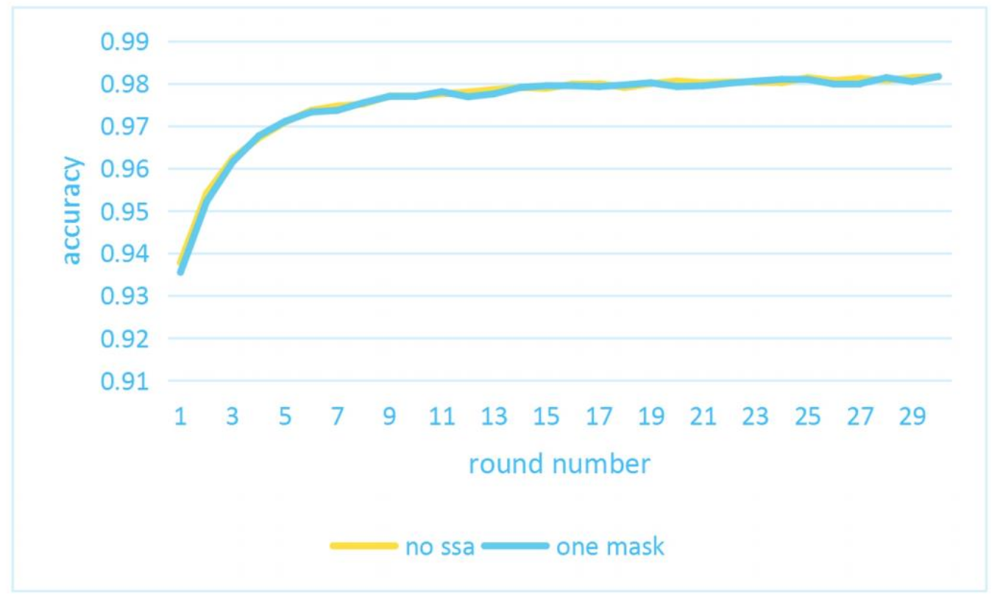

**This document will describe the usage and performances of secure algorithms in detail.**

**Security**:

- [Differential Privacy](#dp)
- [Secure Aggregation](#ssa)


### DP

Differential privacy (DP)  is a system for publicly sharing information about a dataset by describing the patterns of groups within the dataset while withholding information about individuals in the dataset. See [here](https://en.wikipedia.org/wiki/Differential_privacy) to learn more.

DP can be applied in many fields, in federated learning, we refer to:

- [Deep Learning with Differential Privacy](https://arxiv.org/pdf/1607.00133.pdf%20)
- [A General Approach to Adding Differential Privacy to Iterative Training Procedures](https://arxiv.org/pdf/1812.06210.pdf)

Federated learning introduces differential privacy to prevent attackers from performing reverse analysis on intermediate data (such as gradients, etc.) to obtain sample data. Typically, differential privacy achieves the purpose of privacy protection by adding noise to the data.  At the same time, the computational and transmission overhead is small. However,  Since noise is irreversible, it may affect training accuracy.

#### How to use it

You can use the DP for security by adding a 'secure_algorithm' configuration to the job configuration file. For example:

```
"secure_algorithm": {
    "type": "dp",
    "noise_multiplier": 1.0
}
```

See [here](./develop.md#securealgorithm) to learn more.

#### Performances

We train on the [Flowers Recognition](https://www.kaggle.com/datasets/alxmamaev/flowers-recognition) dataset, and found that DP has a little impact on accuracy, but could converge. The following figure is the convergence curve with comparison to no DP.

| IID(FedAvg)          |
| -------------------- |
|  |


### SSA

Secret Share Aggregation(SSA) is a way to use [Secret Share](https://en.wikipedia.org/wiki/Secret_sharing) to ensure data privacy. Firstly, use Secret Share to send the local secret key (mask) shard to each participant. Then in the federated aggregation process, the data reported by each client is encrypted by the local mask shard. Finally, in the server-side aggregation process, the mask is cancelled to obtain the aggregation result.

We refer to the paper: [Practical Secure Aggregation for Privacy-Preserving Machine Learning](https://eprint.iacr.org/2017/281.pdf) 

Note: SSA can face data privacy security issues in semi-honest scenarios and malicious scenarios, and the double mask mode can tolerate client disconnection, but it will lead to a significant increase in the amount of communication and computation. Therefore, different masking methods can be selected according to specific application scenarios to balance privacy and traffic.

#### How to use it

You can use the SSA for security by adding a 'secure_algorithm' configuration to the job configuration file. For example:

```
"secure_algorithm": {
    "type": "ssa",
    "threshold": 3
    "mode": "doublemask"
}
```

See [here](./develop.md#securealgorithm) to learn more.

#### Performances

| onemask                  | doublemask               |
| ------------------------ | ------------------------ |
|  |  |

