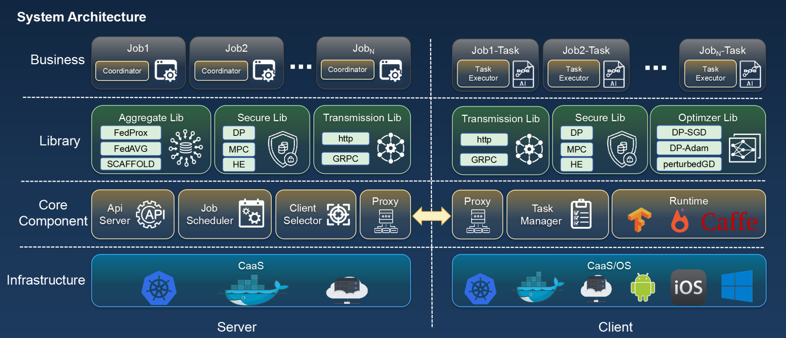
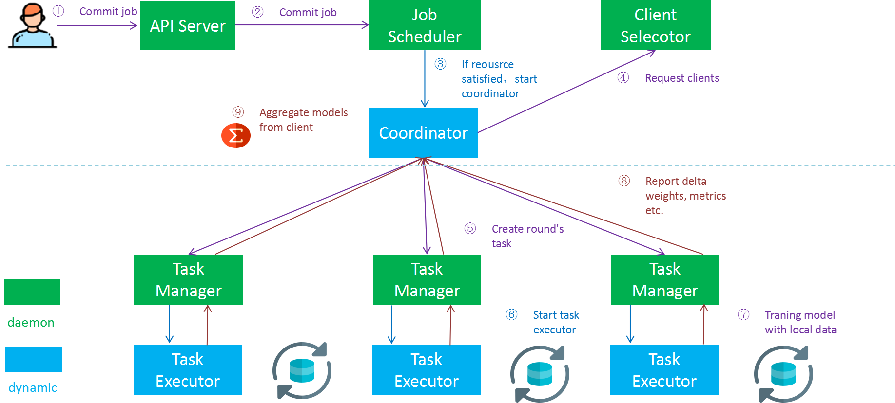

# 架构

Neursafe FL整体架构如上图所示，分为Server和Client两部分。各组件的主要功能介绍如下：

- **基础设施**：为Neursafe FL的运行提供基础设施，服务器侧支持CaaS（Container as a Service）上部署和运行，目前支持的CaaS为Kuberneters，系统支持其它CaaS的扩展。客户端支持CaaS（企业或机构间数据孤岛场景）、容器和OS三种方式，OS当前仅支持Linux。
- **Api Server**：Rest请求的统一入口，将客户请求转发给后端的服务实体，如Job Scheduler等。
- **Job Scheduler**：负责联邦学习作业的管理和调度，具体的根据联邦系统资源情况调度联邦作业，为联邦作业分配客户端，并动态启动Job的Coordinator，完成作业的联邦训练。
- **Client Selector**：负责客户端的注册和管理，响应Coordinator的作业资源请求，根据选择算法为联邦作业分配参与训练的客户端。
- **Proxy**：服务器和客户端的的Proxy组件的功能相似，完成外部消息的反向代理功能，将对应消息转发都对应的作业Coordinator或者Task Manager。
- **Task Manager**：客户端的一部分，为客户端守护程序，负责客户端向服务器的注册和状态上报，并响应服务器侧的Task请求，负责本地Task的调度。
- **Runtime**：这里指现有机器学习框架，Neursafe FL采用当前主流的机器学习框架作为本地训练的执行器，这样可以最大程度保持现有算法的开发习惯，降低联邦迁移成本。当前支持Pytorch，Tensorflow/Keras。
- **Aggregate Lib**：对聚合算法的封装，集成多种联邦聚合算法，并支持算法自定义扩展。
- **Secure Lib**：隐私计算算法库，完成对隐私计算安全协议的封装，用于保护中间数据的安全，避免通过逆向分析等攻击手段获取用户隐私数据。
- **Transmission Lib**：对传输协议的封装，当前支持Http和Grpc两种传输。
- **Optimizer Lib**：用于为配合联邦聚合或者数据安全算法等而产生的联邦特有优化器的封装。
- **Coordinator**：由Job Scheduler在作业调度时动态启动，负责特定作业的联邦训练协调和组织工作，包括，请求参与训练的客户端，下发初始模型以及聚合客户端模型等。
- **Task Executor** ：客户端的一部分，负责联邦作业每轮训练任务的执行，由Task Manager在接收到服务器端的任务请求是动态创建，本地完成本轮模型的本地训练，并将训练结果上报服务器。

除了上述组件，完整的Neursafe FL还有基础支撑组件，包括：

- **数据库**：本系统利用数据来存放作业的配置和状态信息，以及模型信息等，支持MongoDB或者Postgresql。
- **分布式文件系统**：服务器侧使用分布式文件系统来存放模型，度量以及一些中间数据。Neursafe FL支持通过S3和Posix文件接口方式访问分布式文件系统。我们默认使用Minio，也可选择其他DFS。
- **Model Manager**：模型仓库，提供模型的管理能力，可以向仓库提交联邦初始模型以及联邦训练后模型的发布等。
- **命令行客户端NSFL-Ctl**：提供以命令行的方式访问和使用Neursafe FL的能力。

## 作业调度流程

作业的调度流程如上图所示，其步骤如下:

- 用户通过Rest请求或者命令行客户端提交联邦学习作业。
- Api Server收到作业提交请求后转发Job Scheduler处理。
- Job Scheduler记录作业信息，并将其放入待调度队列，如果系统资源满足，则触发作业调度。
- 为满足调度条件的作业启动Coordinator。
- Job Coordinator启动作业执行，向Client Selector请求参与本轮训练的客户端。
- Coordinator向客户端下发联邦训练任务。
- Task Manager接受到任务后，启动本地Task Executor。
- Task Executor以Coordinator下发的模型作为初始模型，利用本地数据完成模型训练。
- Client向Coordinator上报本地训练模型所产生的权重delta值，统计度量信等
- Coordinator在收到各客户端的模型后，对模型进行聚合，判断是否终止联邦训练或者启动下一轮训练。