# Cluster Deployment

[中文](cluster_deploy_zh.md)

Deploying Neursafe FL in cluster mode can provide more comprehensive capabilities, such as job scheduling and management, and optimal clients selection. Kubernetes is recommended as the underlying infrastructure to manage Neursafe FL clusters. Neursafe FL is divided into server side and client side, and different deployment modes can be selected, among which:

**Server:** Adopt cluster deployment mode, deploy core components Job Manager, Model Manger, Client Selector, Proxy;

**Client:** According to the specific scenario, choose standalone mode deployment or cluster mode deployment. For example, in the Cross silo scenario, multiple organizations or institutions need to break the data barriers for federated training. It is recommended that the client side also choose the cluster mode, so client can easily to manage different federation tasks.

Note： Please refer to the [Neursafe FL framework](architecture.md) for the functions of related core components .


##  Preconditions 

### 1. Install Kubernetes 

On the server side and all clients that choose to deploy in cluster mode, Kubernetes must be successfully installed in the environment. For specific installation, please refer to the [official guide](https://kubernetes.io/docs/setup/). 


### 2. Install distributed file system 

Regardless of the server side or the client side, if it is deployed in a cluster, it is recommended to install a distributed file system system that supports S3 or Posix file interface access, such as Minio, for the installation of Minio, refer to the [official guide](https://github.com/minio/minio).

Note: If the distributed file system requires an account and password to log in, please create a K8S Secret object to store the account and password.


### 3.  Install S3FS 

If Minio is installed, you need to install S3FS to mount the S3-compatible object storage to the local file system of all nodes, so that Kubernetes can directly mount the local file system without feeling the underlying specific distributed file system. S3FS installation reference [official guidance](https://github.com/s3fs-fuse/s3fs-fuse) . 


Create directory on all nodes for Neursafe FL's components to store data, such as configuration files, scripts, data, etc.:

```shell
mkdir -p /mnt/neursafe_fl
```

Note: The created directory needs to be mounted to the distributed file system using S3FS, and all nodes can share the directory.


### 4.  Deploy database 

1. Neursafe FL supports MongoDB and PostgreSQL databases and needs to be deployed in advance. For specific deployment, please refer to [MongoDB Installation Guide](https://www.mongodb.com/docs/manual/installation/), [PostgreSQL Installation Guide](https://www .postgresql.org/docs/)

   Note: Create K8S Secret object to store database account and password

2. For the first installation, you need to initialize the database, create a database to store job, model, and task information. The specific database name and table name are configured according to your specific environment:

   - **postgreSQL**

     ```sql
     CREATE DATABASE neursafe_fl;
     
     \c neursafe_fl;
     
     CREATE TABLE jobs (
         id serial primary key,
         data jsonb
     );
     
     CREATE TABLE models (
         id serial primary key,
         data jsonb
     );
     
     CREATE TABLE tasks (
         id serial primary key,
         data jsonb
     );
     ```

      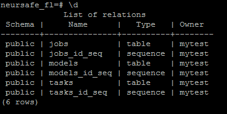

   - **MongoDB**

     ```shell
     use neursafe_fl
     
     db.createCollection("jobs")
     
     db.createCollection("models")
     
     db.createCollection("tasks") 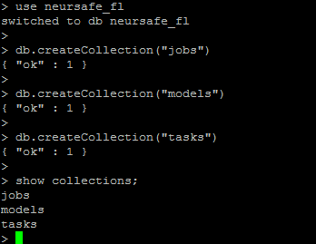
     ```

      


### 5. Build images

 Execute the following command to build the images of all components of Neursafe FL and push them to the specified docker images repository: 

```shell
./deploy/scripts/build_images.sh --registry registryip:port --tag latest --https_proxy proxyhost:port --http_proxy proxyhost:port --no_proxy "localhost"
```

**Parameter parsing:**

registry: If the docker registry address is set, the built images will be pushed to the specified docker registry.

tag: The user can specify the tag of the images, the default is latest.

https_proxy, http_proxy, no_proxy: If your environment needs to access the internet through a proxy, please set the correct proxy configuration.


## Prepare shared directory

Using cluster deployment method, k8s will deploy the pod on any node. Therefore, a shared directory is required so that each node can access the relevant data. Before the deployment of Neursafe FL, the relevant directory needs to be prepared.

### Server side


In the shared root directory, create the relevant folders as shown in the figure above. The folder name can be defined by yourself, as long as it matches the relevant configuration items in the configuration file:

- **models dir:** Model manager uses to save model related files
- **client selector dir:** Used to store configuration and other files required by Client selector
- **proxy dir:** Used to store configuration and other files required by Proxy
- **coordinator configs dir:** The Job scheduler will be used to save the dynamically generated Coordinator startup configuration file, and the Coordinator will find the corresponding startup configuration file from it when it starts.
- **namespace dir:** When creating a federated job, you need to specify a namespace, and the relevant job information, such as scripts, models, etc., will be saved in the corresponding namespace folder. Before creating a job, you need to create a namespace folder first.


### Client side


In the shared directory, create the relevant folders as shown in the figure above. The folder name can be customized, as long as it matches the relevant configuration items in the configuration file:

- **lmdb dir:** Task manager saves job related meta information
- **workspace dir:** The task manager saves the intermediate data of related jobs, such as the model dispatched by the server, etc.
- **datasets dir:** Save datasets and dataset configuration files. There must be a datasets.json configuration file in this directory to specify the relationship between different datasets and their corresponding directories. At the same time, users need to store datasets in this directory. For how to configure, please refer to [The "Preparing Configuration File" chapter in the Quick Start Documentation](quick_start.md)
- **task configs dir:** Save job related configurations, training scripts, and evaluation scripts. The training scripts of federated jobs can not be delivered from the server, so users need to prepare job related configuration, training, and evaluation scripts in advance. For how to configure, please refer to [The "Preparing Configuration File" chapter in the Quick Start Documentation](quick_start.md)
- **config dir:** Used to store configuration files required for Task Manager startup


## Prepare deployment files


As shown in the figure above, the components of Neursafe FL need to communicate with each other, and will also interface with basic components such as DB, DFS, and k8s. Therefore, in order to avoid repetitive configuration of each component, we provide a script that users only need to do once. Configuration, the deployment files and corresponding configuration files of all components can be generated. The script directory is deploy/kubernetes/gen_yamls.py. The script parameters are described as follows:

- type: Specifies whether to generate server configuration or client configuration, and its value is server or client
- config_file: Specify the path to the configuration file
- output: Specifies the path to the output directory where all deployment files, configuration files are generated

Examples are as follows:

```shell
python3 ./deploy/kubernetes/gen_yamls.py --type server --config_file ./deploy/kubernetes/template/server_config.json --output ./output
```


### Server side

1. Prepare a configuration file, configure all components and infrastructure related information, the configuration file can refer to deploy/kubernetes/template/server_config.json

   ```json
   {
     "job_scheduler": {
       "service_name": "nsfl-job-scheduler", # Service name, convenient for other components to access
       "port": 8088,   # External service port, combined with service name is the service address
       "db_collection_name": "jobs",  # Store job information in the specified collection in the database
       "coordinator_configs_dir": "default", # The name of the folder corresponding to the condinator configs dir in the shared directory on the server side (not a relative path or an absolute path, but a folder name)
       "image": "10.67.134.35:5000/nsfl-job-scheduler:latest", # Image used
       "volumes": {
         "workspace": {
           "source": "/mnt/neursafe_fl" # The absolute path of the shared root directory on the server side, which needs to be mounted in the container
         }
       },
       "options": {} # Other optional environment variables, the key is the name of the environment variable, and the value is the value corresponding to the environment variable
     },
     "client_selector": {
       "service_name": "nsfl-client-selector",  # Service name, convenient for other components to access
       "port": 50055,  # External service port, combined with service name is the service address
       "image": "10.67.134.35:5000/nsfl-selector:latest", # Image used
       "volumes": {
         "config": {
           "source": "/mnt/neursafe_fl/selector/" # The absolute path corresponding to the client selector dir folder in the shared root directory of the server side needs to be mounted in the container
         }
       },
       "options": {}  # Other optional environment variables, the key is the name of the environment variable, and the value is the value corresponding to the environment variable
     },
     "model_manager": {
       "service_name": "nsfl-model-manager",  # Service name, convenient for other components to access
       "port": 50057,  # External service port, combined with service name is the service address
       "db_collection_name": "models",  # Store model information in the specified collection in the database
       "image": "10.67.134.35:5000/nsfl-model-manager:latest", # Image used
       "models_dir": "models",  # The name of the folder corresponding to the models dir in the shared directory on the server side (not a relative path or an absolute path, but a folder name)
       "volumes": {
         "workspace": {
           "source": "/mnt/neursafe_fl/"  # The absolute path of the shared root directory on the server side, which needs to be mounted in the container
         }
       },
       "options": {} # Other optional environment variables, the key is the name of the environment variable, and the value is the value corresponding to the environment variable
     },
     "proxy": {
       "service_name": "nsfl-proxy",  # Service name, convenient for other components to access
       "grpc_port": 30091,  # The grpc port for external services, combined with the service name is the service address, the port number range is 30000-32767
       "http_port": 30092,  # The http port for external services, combined with the service name is the service address, the port number range is 30000-32767
       "external": true, # Whether to expose the service externally, it can be easily accessed by external components, such as the task manager component on the client side
       "image": "10.67.134.35:5000/nsfl-proxy:latest", # Image used
       "volumes": {
         "config": {
           "source": "/mnt/neursafe_fl/proxy/" # The absolute path corresponding to the proxy dir folder in the shared root directory on the server side needs to be mounted in the containe
         }
       }
     },
     "api_server": {
       "http_port": 30083,  # http port for external services, port number range 30000-32767
       "https_port": 30084, # https port for external services, port number range 30000-32767
       "external": true, # Whether to expose the service externally to facilitate user access
     },
     "coordinator": {
       "image": "10.67.134.35:5000/nsfl-coordinator:latest", # Image used
       "port": 50051 # coordinator's external service port
     },
     "k8s": {
       "address": "10.67.134.15:8080", # k8s api server address
       "gpu_rs_key": "nvidia.com/gpu", # The resource key value of GPU resources of k8s, used to specify the using amount of GPU resources when applying for resources
       "namespace": "default" # Specify which namespace that system components are deployed in
     },
     "storage": {
       "type": "s3",  # Access type used by DFS storage
       "address": "http://10.67.134.15:9000",  # DFS service address
       "secret_key_ref": {
         "name": "miniosecret", # The name of the k8s secret object, used to store the account and password for DFS access
         "user_key": "username", # The key value corresponding to the username in the above k8s secret object
         "passwd_key": "password" # The key value corresponding to the password in the above k8s secret object
       }
   },
     "db": {
       "type": "postgreSQL",  # database type
       "address": "10.67.134.32:12202",  # database access address
       "name": "neursafe_fl",   # database name
       "secret_key_ref": {
         "name": "pgsecret", # The name of the k8s secret object, used to store the account and password for database access
         "user_key": "username", # The key value corresponding to the username in the above k8s secret object
         "passwd_key": "password" # The key value corresponding to the password in the above k8s secret object
       }},
     "others": {
       "log_level": "info" # Specify log level for all components
     }
   }
   ```

   The configuration file specifies the configuration items that must be configured, and other optional configuration items for each component can be configured under "options", such as "options": {"REPORT_PERIOD": 10}, optional configuration items for all components (Environment variable) can [Refer to Environment Variable Configuration](develop.md)

2. Execute the script to generate all deployment files and configuration files

   ```shell
   python3 ./deploy/kubernetes/gen_yamls.py --type server --config_file ./deploy/kubernetes/template/server_config.json --output ./output
   ```

3. Copy or move the nginx.conf file generated in the output to the folder corresponding to the server side proxy directory mentioned in the Shared Directories section

4. Copy or move the client_selector_setup.json file generated in output to the folder corresponding to the client selector dir on the server side mentioned in the Shared Directory chapter

   

### Client side

1. Prepare a configuration file, configure all components and infrastructure related information, the configuration file can refer to deploy/kubernetes/template/client_config.json

   ```json
   {
     "task_manager": {
       "service_name": "nsfl-task-manager",    # Service name, convenient for other components to access
       "port": 9090,  # External service port, combined with service name is the service address
       "external": true,  # Whether to expose the service externally, it can facilitate the access of external components, such as the component access on the server side
       "db_collection_name": "tasks",  # Store task information in the specified collection in the database
       "image": "10.67.134.35:5000/nsfl-client-cpu:latest", # Image used
       "server_address": "10.67.134.15.9001", # The external grpc access address of the proxy component on the server side
       "runtime": "tensorflow,pytorch",  # Runtimes supported by the client, separated by ","
       "storage_quota": "1024",       # The storage limit that can be used by workspace files in the shared directory on the client side
       "registration": "True",    # Whether to register with the client selector on the server side, after registration, the server side can select appropriate nodes to participate in federated learning based on the node information
       "volumes": {
         "lmdb": {
           "source": "/mnt/neursafe_fl/lmdb" # The absolute path of the lmdb dir folder in the shared directory on the client side, the user mounts it into the container
         },
         "workspace": {
           "source": "/mnt/neursafe_fl/workspace" # The absolute path of the workspace dir folder in the shared directory on the client side, the user mounts it in the container
         },
         "datasets": {
           "source": "/mnt/neursafe_fl/datasets" # The absolute path of the datasets dir folder in the shared directory on the client side, the user mounts it in the container
         },
         "task_configs": {
           "source": "/mnt/neursafe_fl/task_configs" # The absolute path of the task configs dir folder in the shared directory on the client side, the user mounts it in the container
         },
         "config": {
           "source": "/mnt/neursafe_fl/config/" # The absolute path of the config dir folder in the shared directory on the client side, the user mounts it in the container
         }
       },
       "options": {} # Other optional environment variables, the key is the name of the environment variable, and the value is the value corresponding to the environment variable
     },
     "executor": {
       "image": "10.67.134.35:5000/nsfl-client-cpu:latest", # Image used
       "port": 8050,                    # Access port provided by executor
       "http_proxy": "",                # The proxy required by the executor(if the environment requires proxy to access internet, it needs to be configured)
       "https_proxy": ""                # The proxy required by the executor(if the environment requires proxy to access internet, it needs to be configured)
     },
     "k8s": {
       "address": "10.67.134.15:8080", # k8s api server address
       "gpu_rs_key": "nvidia.com/gpu",  # The resource key value of GPU resources of k8s, used to specify the using amount of GPU resources when applying for resources
       "namespace": "default" # Specify which namespace that system components are deployed in
     },
     "db": {
       "type": "postgreSQL",          # database type
       "address": "10.67.134.32:12202",  # database access address
       "name": "neursafe_fl",    # database name
       "secret_key_ref": {
         "name": "pgsecret",     # The name of the k8s secret object, used to store the account and password for database access
         "user_key": "username", # The key value corresponding to the username in the above k8s secret object
         "passwd_key": "password" # The key value corresponding to the password in the above k8s secret object
       }},
     "others": {
       "log_level": "info"  # Specify log level for all components
     }
   }
   ```

2. Execute the script to generate all deployment files and configuration files

   ```shell
   python3 ./deploy/kubernetes/gen_yamls.py --type client --config_file ./deploy/kubernetes/template/client_config.json --output ./output
   ```

3. Copy or move the task_manager_setup.json file generated in the output to the folder corresponding to the config dir on the client side mentioned in the Shared Directory chapter


## Server deployment 

The server side adopts the cluster deployment mode by default, and deploys Job Scheduler, Model Manager, Client Selector, Proxy, and API Server on Kubernetes.


### Deploy Job Scheduler

1. Go to the deployment file output directory specified in the previous chapter, and execute the following command to deploy Job Scheduler

   ```shell
   kubectl create -f job-scheduler.yaml
   ```

   

3. To verify whether the deployment is successful, execute the following command to check whether the Pod of the Job Scheduler is in the Runnin state:

   ```shell
    kubectl get pod
   ```

    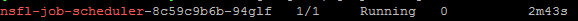


### Deploy Model Manager

1. Go to the deployment file output directory specified in the previous chapter, and execute the following command to deploy Model Manager

   ```shell
   kubectl create -f model-manager.yaml
   ```

   

3. To verify whether the deployment is successful, execute the following command to check whether the Pod of the Model Manager is Running state

   ```shell
   kubectl get pod
   ```

    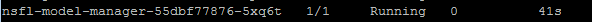


### Deploy Client Selector

1. Go to the deployment file output directory specified in the previous chapter, and execute the following command to deploy Client Selector

   ```shell
   kubectl create -f selector.yaml
   ```

   

3. To verify whether the deployment is successful, execute the following command to check whether the Pod of the Client Selector is Running state:

   ```shell
   kubectl get pod
   ```

    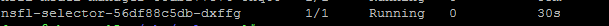

   

### Deploy Proxy

1. Go to the deployment file output directory specified in the previous chapter, and execute the following command to deploy Proxy

   ```shell
   kubectl create -f proxy.yaml
   ```

   

4. To verify whether the deployment is successful, execute the following command to check whether the Pod of the Proxy is Running state

   ```shell
   kubectl get pod
   ```

    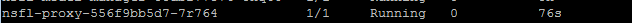


### Deploy API Server

Use K8S Ingress to realize the function of API Server


1. Go to the deployment file output directory specified in the previous chapter, and execute the following command to deploy ingress nginx:

   ```shell
   kubectl create -f ingress-nginx.yaml
   ```

   

2. Go to the deployment file output directory specified in the previous chapter, and execute the following command to configure the routing rules of Job Scheduler:

   ```shell
kubectl create -f ingress-job-scheduler.yaml
   ```
   
   

3. Go to the deployment file output directory specified in the previous chapter, and execute the following command to configure the routing rules of Model Manager:

   ```shell
kubectl create -f  ingress-model-manager.yaml
   ```
   
   

4. To verify whether the deployment is successful, execute the following command to check whether the Pod of the Ingress-Nginx is Running state

   ```shell
   kubectl get pod -n ingress-nginx
   ```

   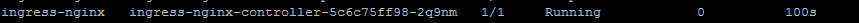


## Task Manager（Client）Deployment

Different clients can choose different deployment modes: standalone mode and cluster mode


### Standalone Mode

1. Prepare the setup configuration setup.json of the Task Manager, refer to the description of the client setup configuration parameters in [Deployment Configuration Instructions](develop.md)

   

2. Run client container

   ```shell
   docker run -v /workspace/neursafe_fl/task_manager/:/workspace/neursafe_fl/task_manager/ --net=host nsfl-client-cpu --config_file /workspace/neursafe_fl/task_manager/setup.json
   ```

   Note: 1. Please use the correct client image name generated by your own building environment; 2. Mount the required data, configuration, directory, etc. into the container


### Cluster Mode

1. Go to the deployment file output directory specified in the previous chapter, and execute the following command to configure the routing rules of Task Manager:

   ```shell
   kubectl create -f task-manager.yaml
   ```

   

4. To verify whether the deployment is successful, execute the following command to check whether the Pod of the Task Manager is Running state

   ```shell
   kubectl get pod
   ```

    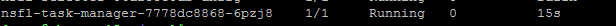

   

## Deployment Verification

1. Prepare a training script, evaluation script, initial model, configuration of a federated job tf_mnist_fl according to the configuration instructions of the job in [Deployment Configuration Instructions](develop.md)

    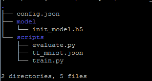

   

2. Create a federated job and execute the following commands, theinstallation of nsfl-ctl refer to [the installation guide document](install.md)

   ```shell
   nsfl-ctl create job -w tf_mnist_fl/ default
   ```

   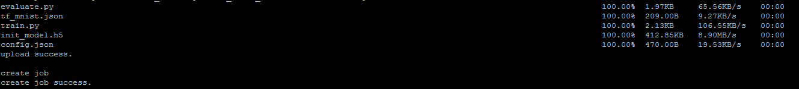

   

3. Query running state of federated job

   ```shell
   nsfl-ctl get job -w tf_mnist_fl/ default
   ```

    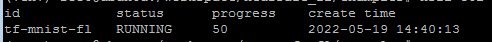
