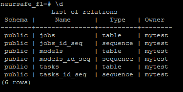
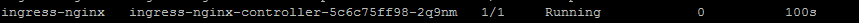
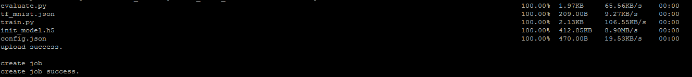

# 集群部署

[English](cluster_deploy.md)

集群模式部署Neursafe FL，可以提供更全面的能力，如作业调度和管理、客户端优选等。推荐Kubernetes作为底层基础设施管理Neursafe FL集群。Neursafe FL分为Server端和Client端，可以选择不同的部署模式，其中：

**Server端：**采用集群部署模式，部署核心组件Job Manager、Model Manger、Client Selector、Proxy；

**Client端：**根据具体场景，选择单机模式部署或者集群模式部署，如在Cross silo场景下，多个组织或机构之间需要打破数据壁垒进行联邦训练，建议Client端也选择集群模式，便于管理不同的联邦作业。

注意：相关组件的功能请参考[Neursafe FL框架](architecture_zh.md)


## 前置条件

### 1. 安装Kubernetes

Server端以及选择集群模式部署的所有客户端，首先需要环境已经成功安装Kubernetes，具体安装参考[官方指导](https://kubernetes.io/docs/setup/)。


### 2. 安装分布式文件系统

不论Server端或者Client端，如果采用集群方式部署，建议安装支持S3或者Posix文件接口方式访问的分布式文件系统系统，比如Minio，Minio的安装参考[官方指导](https://github.com/minio/minio)。

注意：分布式文件系统需要账号密码登录的，请创建K8S的Secret对象用于存储账号、密码


### 3. 安装S3FS

如果安装了Minio，需要安装S3FS将兼容S3的对象存储挂载到所有节点的本地文件系统，这样可以方便Kubernetes直接挂载本地文件系统而不需要感觉底层具体的分布式文件系统，S3FS的安装参考[官方指导](https://github.com/s3fs-fuse/s3fs-fuse)。


在所有节点创建目录用于Neursafe FL的组件存储数据，如配置文件、脚本、数据等：

```shell
mkdir -p /mnt/neursafe_fl
```

注意：创建的目录需要使用S3FS挂载到分布式文件系统，所有节点即可目录共享


### 4. 部署数据库

1. Neursafe FL支持MongoDB和PostgreSQL数据库，需要提前部署，具体部署参考[MongoDB安装指导](https://www.mongodb.com/docs/manual/installation/)、[PostgreSQL安装指导](https://www.postgresql.org/docs/)

   注意：创建K8S的Secret对象用于存储数据库账号、密码

   

2. 首次安装，需要初始化数据库，创建数据库存储作业、模型、任务信息，具体的数据库名、表名根据你的具体环境进行配置：

   - **postgreSQL**

     ```sql
     CREATE DATABASE neursafe_fl;
     
     \c neursafe_fl;
     
     CREATE TABLE jobs (
         id serial primary key,
         data jsonb
     );
     
     CREATE TABLE models (
         id serial primary key,
         data jsonb
     );
     
     CREATE TABLE tasks (
         id serial primary key,
         data jsonb
     );
     ```

      

     

   - **MongoDB**

     ```shell
     use neursafe_fl
     
     db.createCollection("jobs")
     
     db.createCollection("models")
     
     db.createCollection("tasks")
     ```

      

   

### 5. 编译镜像

执行如下命令，可以编译Neursafe FL所有组件的镜像，并推送到指定的镜像仓库：

``````shell
./deploy/scripts/build_images.sh --registry registryip:port --tag latest --https_proxy proxyhost:port --http_proxy proxyhost:port --no_proxy "localhost"
``````

**参数解析：**

registry: 若设置镜像仓库地址，会将编译的镜像推送到指定镜像仓库

tag: 用户可指定镜像的tag，默认latest

https_proxy, http_proxy, no_proxy: 如果你的环境需要通过代理访问互联网，请设置正确的代理配置


## Server端部署

Server端默认采用集群部署模式，在Kubernetes上部署Job Scheduler，Model Manager , Client Selector, Proxy，API Server


### 部署Job Scheduler

1. 准备Job Scheduler的部署脚本job-scheduler.yaml，yaml中需要配置的环境变量等请参考[部署配置说明](develop.md)，可以参考deploy/kubernetes/yamls/目录下的job-scheduler.yaml模板

   注意：请根据你的K8S环境进行相关配置

   

2. 执行如下命令部署Job Scheduler

   ```shell
   kubectl create -f job-scheduler.yaml
   ```

   

3. 验证部署是否成功，执行如下命令查看Job Scheduler的Pod是否为Runnin状态

   ```shell
    kubectl get pod
   ```

    

   

### 部署Model Manager

1. 准备Model Manager的部署脚本model-manager.yaml，yaml中需要配置的环境变量等请参考[部署配置说明](develop.md)，可以参考deploy/kubernetes/yamls/目录下的model-manager.yaml模板

   注意：请根据你的K8S环境进行相关配置

   

2. 执行如下命令部署Model Manager

   ```shell
   kubectl create -f model-manager.yaml
   ```

   

3. 验证部署是否成功，执行如下命令查看Model Manager的Pod是否Running状态

   ```shell
   kubectl get pod
   ```

    

   

### 部署Client Selector

1. 准备Client Selector的部署脚本selector.yaml，yaml中需要配置的环境变量等请参考[部署配置说明](develop.md)，可以参考deploy/kubernetes/yamls/目录下的selector.yaml模板

   注意：请根据你的K8S环境进行相关配置，另外，ClientSelector的启动参数请参考[部署配置说明](develop.md)在yaml脚本的comnand中进行配置

   

2. 执行如下命令部署Client Selector

   ```shell
   kubectl create -f selector.yaml
   ```

   

3. 验证部署是否成功，执行如下命令查看Client Selctor的Pod是否Running状态

   ```shell
   kubectl get pod
   ```

    

   

### 部署Proxy

1. 准备Proxy的部署脚本proxy.yaml，yaml中需要配置的环境变量等请参考[部署配置说明](develop.md)，可以参考deploy/kubernetes/yamls/目录下的proxy.yaml模板

   注意：请根据你的K8S环境进行相关配置

   

2. 准备nginx.conf，参考deploy/configs/proxy/conf/nginx.conf，默认的配置已经打入proxy镜像中，如果你修改了相关配置，请在上述proxy.yaml中将新的nginx.conf挂载到Pod的/nginx/conf/nginx.conf

   

3. 执行如下命令部署Proxy

   ```shell
   kubectl create -f proxy.yaml
   ```

   

4. 验证部署是否成功，执行如下命令查看Proxy的Pod是否Running状态

   ```shell
   kubectl get pod
   ```

    


### 部署API Server

采用K8S Ingress的方式实现API Server的功能


1. 部署Ingress-Nginx，参考deploy/kubernetes/yamls/目录下的ingress-nginx.yaml，其实Service对象中port的配置参考你的具体环境

   ```shell
   kubectl create -f ingress-nginx.yaml
   ```

   

2. 配置Job Scheduler的路由规则， 可以参考deploy/kubernetes/yamls/目录下的ingress-job-scheduler.yaml模板

   注意：yaml中的serviceName请按你的具体环境配置

   ```shell
   kubectl create -f ingress-job-scheduler.yaml
   ```

   

3. 配置Model Manager的路由规则，可以参考deploy/kubernetes/yamls/目录下的ingress-model-manager.yaml模板

   注意：yaml中的serviceName请按你的具体环境配置

   ```shell
   kubectl create -f  ingress-model-manager.yaml
   ```

   

4. 验证部署是否成功，执行如下命令查看Ingress-Nginx的Pod是否Running状态

   ```shell
   kubectl get pod -n ingress-nginx
   ```

   


## Task Manager（Client端）部署

不同的客户端可以选择不同的部署模式：单机模式和集群模式


### 单机模式

1. 准备好Task Manager的启动配置setup.json，参考[部署配置说明](develop.md)中client启动配置参数说明

   

2. 运行Client容器

   ```shell
   docker run -v /workspace/neursafe_fl/task_manager/:/workspace/neursafe_fl/task_manager/ --net=host nsfl-client-cpu --config_file /workspace/neursafe_fl/task_manager/setup.json
   ```

   注意：1. Client镜像名称请使用自己环境编译生成的镜像名称；2. 把需要的数据、配置、目录等挂载到容器内


### 集群模式

1. 准备好Task Manager的启动配置setup.json，参考[部署配置说明](develop.md)中client启动配置参数说明

   

2. 准备Task Manager的部署脚本task-manager.yaml，yaml中需要配置的环境变量等请参考[部署配置说明](develop.md)，可以参考deploy/kubernetes/yamls/目录下的task-manager.yaml模板

   注意：请根据你的K8S环境进行相关配置

   

3. 执行如下命令部署Task Manager

   ```shell
   kubectl create -f task-manager.yaml
   ```

   

4. 验证部署是否成功，执行如下命令查看Task Manager的Pod是否Running状态

   ```shell
   kubectl get pod
   ```

    

   

## 部署验证

1. 根据[部署配置说明](develop.md)中作业的配置说明，准备一个联邦作业tf_mnist_fl的训练脚本、评估脚本、初始模型、配置

    

   

2. 参考[部署配置说明](develop.md)中命令行客户端的使用说明，创建联邦作业，执行如下命令

   ```shell
   nsfl-ctl create job -w tf_mnist_fl/ default
   ```

   

   

3. 查看联邦作业运行情况

   ```shell
   nsfl-ctl get job -w tf_mnist_fl/ default
   ```

    