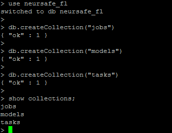
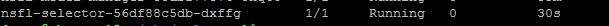
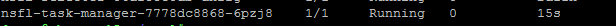
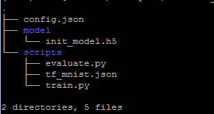

# 集群部署

[English](cluster_deploy.md)

集群模式部署Neursafe FL，可以提供更全面的能力，如作业调度和管理、客户端优选等。推荐Kubernetes作为底层基础设施管理Neursafe FL集群。Neursafe FL分为Server端和Client端，可以选择不同的部署模式，其中：

**Server端:** 采用集群部署模式，部署核心组件Job Manager、Model Manger、Client Selector、Proxy；

**Client端:** 根据具体场景，选择单机模式部署或者集群模式部署，如在Cross silo场景下，多个组织或机构之间需要打破数据壁垒进行联邦训练，建议Client端也选择集群模式，便于管理不同的联邦作业。

注意：相关组件的功能请参考[Neursafe FL框架](architecture_zh.md)


## 前置条件

### 1. 安装Kubernetes

Server端以及选择集群模式部署的所有客户端，首先需要环境已经成功安装Kubernetes，具体安装参考[官方指导](https://kubernetes.io/docs/setup/)。


### 2. 安装分布式文件系统

不论Server端或者Client端，如果采用集群方式部署，建议安装支持S3或者Posix文件接口方式访问的分布式文件系统系统，比如Minio，Minio的安装参考[官方指导](https://github.com/minio/minio)。

注意：分布式文件系统需要账号密码登录的，请创建K8S的Secret对象用于存储账号、密码


### 3. 安装S3FS

如果安装了Minio，需要安装S3FS将兼容S3的对象存储挂载到所有节点的本地文件系统，这样可以方便Kubernetes直接挂载本地文件系统而不需要感觉底层具体的分布式文件系统，S3FS的安装参考[官方指导](https://github.com/s3fs-fuse/s3fs-fuse)。


在所有节点创建目录用于Neursafe FL的组件存储数据，如配置文件、脚本、数据等：

```shell
mkdir -p /mnt/neursafe_fl
```

注意：创建的目录需要使用S3FS挂载到分布式文件系统，所有节点即可目录共享


### 4. 部署数据库

1. Neursafe FL支持MongoDB和PostgreSQL数据库，需要提前部署，具体部署参考[MongoDB安装指导](https://www.mongodb.com/docs/manual/installation/)、[PostgreSQL安装指导](https://www.postgresql.org/docs/)

   注意：创建K8S的Secret对象用于存储数据库账号、密码

   

2. 首次安装，需要初始化数据库，创建数据库存储作业、模型、任务信息，具体的数据库名、表名根据你的具体环境进行配置：

   - **postgreSQL**

     ```sql
     CREATE DATABASE neursafe_fl;
     
     \c neursafe_fl;
     
     CREATE TABLE jobs (
         id serial primary key,
         data jsonb
     );
     
     CREATE TABLE models (
         id serial primary key,
         data jsonb
     );
     
     CREATE TABLE tasks (
         id serial primary key,
         data jsonb
     );
     ```

      

     

   - **MongoDB**

     ```shell
     use neursafe_fl
     
     db.createCollection("jobs")
     
     db.createCollection("models")
     
     db.createCollection("tasks")
     ```

      

   

### 5. 编译镜像

执行如下命令，可以编译Neursafe FL所有组件的镜像，并推送到指定的镜像仓库：

``````shell
./deploy/scripts/build_images.sh --registry registryip:port --tag latest --https_proxy proxyhost:port --http_proxy proxyhost:port --no_proxy "localhost"
``````

**参数解析：**

registry: 若设置镜像仓库地址，会将编译的镜像推送到指定镜像仓库

tag: 用户可指定镜像的tag，默认latest

https_proxy, http_proxy, no_proxy: 如果你的环境需要通过代理访问互联网，请设置正确的代理配置


## 准备共享目录

采用了集群部署的方式，k8s会将pod部署在任意节点，因此，需要一个共享目录，让各个节点都能访问到相关数据，在正式部署Neursafe FL之前，需要先将相关目录准备好

### Server端


在共享根目录下，创建上图所示的相关文件夹，文件夹名可以自己定义，只需要和配置文件中的相关配置项匹配即可：

- **models dir：** Model manager会用来保存模型相关的文件
- **client selector dir：** 用于存储Client selecor需要的配置等文件
- **proxy dir：** 用于存储Proxy需要的配置等文件
- **coordinator configs dir：** Job scheduler会用来保存动态生成的Coordinator启动的配置文件，Coordinator启动时从中找到对应的启动配置文件
- **namespace dir：** 创建联邦作业时需要指定namespace，在对应的namespace文件夹内会保存相关作业的信息，如脚本、模型等，所有在创建作业前需要先创建namespace文件夹


### Client端


在共享目录下，创建上图所示的相关文件夹，文件夹名可以自定义，只需要和配置文件中的相关配置项匹配即可：

- **lmdb dir：** Task manager会保存作业相关的元信息
- **workspace dir：** Task manager会保存相关作业的中间数据，如：服务器下发的模型等
- **datasets dir：** 保存数据集、数据集配置文件，在该目录下必须有个datasets.json的配置文件，用于指定不同数据集与其对应的目录关系，同时，用户需要把数据集存在这个目录中，如何配置请参考[快速使用文档中“准备配置文件”章节](quick_start_zh.md)
- **task configs dir：** 保存作业相关的配置、训练脚本、评估脚本，联邦作业的训练脚本可以不从server端下发，所以需要用户提前准备好作业相关的配置、训练和评估脚本，如何配置请参考[快速使用文档中“准备配置文件”章节](quick_start_zh.md)
- **config dir：** 用于存储Task manager启动需要的配置文件


## 准备部署文件


如上图所示，Neursafe FL的组件需要相互通信，也会对接DB、DFS、k8s这些基础组件，因此为了避免给每个组件都做重复性的配置，我们提供了一个脚本，用户只需一次性配置，即可生成所有组件的部署文件和对应的配置文件，脚本目录为deploy/kubernetes/gen_yamls.py，脚本参数说明如下：

- type：指定生成server的配置还是client端的配置，其值为server或client
- config_file：指定配置文件的路径
- output：指定生成所有部署文件、配置文件的输出目录的路径

举例如下：

```shell
python3 ./deploy/kubernetes/gen_yamls.py --type server --config_file ./deploy/kubernetes/template/server_config.json --output ./output
```


### Server端

1. 准备配置文件，配置好所有组件、基础设施的相关信息，配置文件可以参考deploy/kubernetes/template/server_config.json

   ```json
   {
     "job_scheduler": {
       "service_name": "nsfl-job-scheduler", # 服务名，方便其他组件访问
       "port": 8088,                         # 对外服务端口，与service name组合就是服务地址
       "db_collection_name": "jobs",  # 将job信息存储到数据库中指定的collection内
       "coordinator_configs_dir": "default", # server端共享目录下condinator configs dir所对应的文件夹名称（不是相对路径或绝对路径，是文件夹名）
       "image": "10.67.134.35:5000/nsfl-job-scheduler:latest", # 使用的镜像
       "volumes": {
         "workspace": {
           "source": "/mnt/neursafe_fl" # server端共享根目录的绝对路径，需要挂载到容器内
         }
       },
       "options": {} # 其他可选的环境变量，key为环境变量名，value为环境变量对应的值
     },
     "client_selector": {
       "service_name": "nsfl-client-selector",  # 服务名，方便其他组件访问
       "port": 50055,                           # 对外服务端口，与service name组合就是服务地址
       "image": "10.67.134.35:5000/nsfl-selector:latest", # 使用的镜像
       "volumes": {
         "config": {
           "source": "/mnt/neursafe_fl/selector/" # server端共享根目录下client selector dir文件夹对应的的绝对路径，需要挂载到容器内
         }
       },
       "options": {}  # 其他可选的环境变量，key为环境变量名，value为环境变量对应的值
     },
     "model_manager": {
       "service_name": "nsfl-model-manager",  # 服务名，方便其他组件访问
       "port": 50057,                         # 对外服务端口，与service name组合就是服务地址
       "db_collection_name": "models",        # 将model信息存储到数据库中指定的collection内
       "image": "10.67.134.35:5000/nsfl-model-manager:latest", # 使用的镜像
       "models_dir": "models",  # server端共享目录下models dir所对应的文件夹名称（不是相对路径或绝对路径，是文件夹名）
       "volumes": {
         "workspace": {
           "source": "/mnt/neursafe_fl/"  # server端共享根目录的绝对路径，需要挂载到容器内
         }
       },
       "options": {} # 其他可选的环境变量，key为环境变量名，value为环境变量对应的值
     },
     "proxy": {
       "service_name": "nsfl-proxy",  # 服务名，方便其他组件访问
       "grpc_port": 30091,        # 对外服务的grpc端口，与service name组合就是服务地址,端口号范围30000-32767
       "http_port": 30092,        # 对外服务的http端口，与service name组合就是服务地址,端口号范围30000-32767
       "external": true, # 是否对外暴露服务，可以方便外部组件访问，如client端的task manager组件访问
       "image": "10.67.134.35:5000/nsfl-proxy:latest", # 使用的镜像
       "volumes": {
         "config": {
           "source": "/mnt/neursafe_fl/proxy/" # server端共享根目录下proxy dir文件夹对应的的绝对路径，需要挂载到容器内
         }
       }
     },
     "api_server": {
       "http_port": 30083,  # 对外服务的http端口,端口号范围30000-32767
       "https_port": 30084, # 对外服务的https端口,端口号范围30000-32767
       "external": true, # 是否对外暴露服务，方便用户访问
     },
     "coordinator": {
       "image": "10.67.134.35:5000/nsfl-coordinator:latest", # 使用的镜像
       "port": 50051 # coordinator对外的服务端口
     },
     "k8s": {
       "address": "10.67.134.15:8080", # k8s的api server访问地址
       "gpu_rs_key": "nvidia.com/gpu", # k8s的GPU资源的资源key值，用于申请资源时指定使用GPU资源
       "namespace": "default" # 指定系统组件部署在哪个命名空间
     },
     "storage": {
       "type": "s3",  # DFS存储所使用的访问类型
       "address": "http://10.67.134.15:9000",  # DFS对外服务地址
       "secret_key_ref": {
         "name": "miniosecret", # k8s secret对象的名称，用于存储DFS访问的账号，密码
         "user_key": "username", # 上述k8s secret对象中用户名对应的key值
         "passwd_key": "password" # 上述k8s secret对象中密码对应的key值
       }
   },
     "db": {
       "type": "postgreSQL",  # 数据库类型
       "address": "10.67.134.32:12202",  # 数据库访问地址
       "name": "neursafe_fl",   # 数据库名称
       "secret_key_ref": {
         "name": "pgsecret", # k8s secret对象的名称，用于存储数据库访问的账号，密码
         "user_key": "username", # 上述k8s secret对象中用户名对应的key值
         "passwd_key": "password" # 上述k8s secret对象中密码对应的key值
       }},
     "others": {
       "log_level": "info" # 指定所有组件的日志级别
     }
   }
   ```

   配置文件指定了必须要配置的配置项，各个组件其他可选的配置项可配置到对应组件名称内的options下，如"options": {"REPORT_PERIOD": 10}，所有组件的可选配置项（环境变量）可[参考环境变量配置](develop.md)

2. 执行脚本，生成所有的部署文件和配置文件

   ```shell
   python3 ./deploy/kubernetes/gen_yamls.py --type server --config_file ./deploy/kubernetes/template/server_config.json --output ./output
   ```

3. 把在output中生成的nginx.conf文件，复制或移动到共享目录章节中提到的server端的proxy dir所对应的文件夹下

4. 把在output中生成的client_selector_setup.json文件，复制或移动到共享目录章节中提到的server端的client selector dir所对应的文件夹下

   

### Client端

1. 准备配置文件，配置好所有组件、基础设施的相关信息，配置文件可以参考deploy/kubernetes/template/client_config.json

   ```json
   {
     "task_manager": {
       "service_name": "nsfl-task-manager",    # 服务名，方便其他组件访问
       "port": 9090,                           # 对外服务端口，与service name组合就是服务地址
       "external": true,  # 是否对外暴露服务，可以方便外部组件访问，如server端的组件访问
       "db_collection_name": "tasks",  # 将task信息存储到数据库中指定的collection内
       "image": "10.67.134.35:5000/nsfl-client-cpu:latest", # 使用的镜像
       "server_address": "10.67.134.15.9001", # server端proxy组件对外的grpc访问地址
       "runtime": "tensorflow,pytorch",  # 客户端支持的运行时，如多个用,隔开
       "storage_quota": "1024",       # client端共享目录下workspace文件能使用的存储限制
       "registration": "True",    # 是否向server端的client selector注册，注册后，server端可以根据节点信息，刷选合适的节点参与联邦学习
       "volumes": {
         "lmdb": {
           "source": "/mnt/neursafe_fl/lmdb" # client端共享目录下lmdb dir文件夹的绝对路径，用户挂载到容器内
         },
         "workspace": {
           "source": "/mnt/neursafe_fl/workspace" # client端共享目录下workspace dir文件夹的绝对路径，用户挂载到容器内
         },
         "datasets": {
           "source": "/mnt/neursafe_fl/datasets" # client端共享目录下datasets dir文件夹的绝对路径，用户挂载到容器内
         },
         "task_configs": {
           "source": "/mnt/neursafe_fl/task_configs" # client端共享目录下task configs dir文件夹的绝对路径，用户挂载到容器内
         },
         "config": {
           "source": "/mnt/neursafe_fl/config/" # client端共享目录下config dir文件夹的绝对路径，用户挂载到容器内
         }
       },
       "options": {} # 其他可选的环境变量，key为环境变量名，value为环境变量对应的值
     },
     "executor": {
       "image": "10.67.134.35:5000/nsfl-client-cpu:latest", # 使用的镜像
       "port": 8050,                    # executor提供的访问端口
       "http_proxy": "",                # executor需要的代理（若环境需要代理联网，需配置）
       "https_proxy": ""                # executor需要的代理（若环境需要代理联网，需配置）
     },
     "k8s": {
       "address": "10.67.134.15:8080", # k8s的api server访问地址
       "gpu_rs_key": "nvidia.com/gpu", # k8s的GPU资源的资源key值，用于申请资源时指定使用GPU资源
       "namespace": "default" # 指定系统组件部署在哪个命名空间
     },
     "db": {
       "type": "postgreSQL",          # 数据库类型
       "address": "10.67.134.32:12202",  # 数据库访问地址
       "name": "neursafe_fl",    # 数据库名称
       "secret_key_ref": {
         "name": "pgsecret",     # k8s secret对象的名称，用于存储数据库访问的账号，密码
         "user_key": "username", # 上述k8s secret对象中用户名对应的key值
         "passwd_key": "password" # 上述k8s secret对象中密码对应的key值
       }},
     "others": {
       "log_level": "info"  # 指定所有组件的日志级别
     }
   }
   ```

2. 执行脚本，生成所有的部署文件和配置文件

   ```shell
   python3 ./deploy/kubernetes/gen_yamls.py --type client --config_file ./deploy/kubernetes/template/client_config.json --output ./output
   ```

3. 把在output中生成的task_manager_setup.json文件，复制或移动到共享目录章节中提到的client端的config dir所对应的文件夹下

   

## Server端部署

Server端默认采用集群部署模式，在Kubernetes上部署Job Scheduler，Model Manager , Client Selector, Proxy，API Server


### 部署Job Scheduler

1. 进入到上一章节指定的部署文件输出目录内，执行如下命令部署Job Scheduler

   ```shell
   kubectl create -f job-scheduler.yaml
   ```

   

2. 验证部署是否成功，执行如下命令查看Job Scheduler的Pod是否为Runnin状态

   ```shell
    kubectl get pod
   ```

    

   

### 部署Model Manager

1. 进入到上一章节指定的部署文件输出目录内，执行如下命令部署Model Manager

   ```shell
   kubectl create -f model-manager.yaml
   ```

   

2. 验证部署是否成功，执行如下命令查看Model Manager的Pod是否Running状态

   ```shell
   kubectl get pod
   ```

    

   

### 部署Client Selector

1. 进入到上一章节指定的部署文件输出目录内，执行如下命令部署Client Selector

   ```shell
   kubectl create -f selector.yaml
   ```

   

2. 验证部署是否成功，执行如下命令查看Client Selctor的Pod是否Running状态

   ```shell
   kubectl get pod
   ```

    

   

### 部署Proxy

1. 进入到上一章节指定的部署文件输出目录内，执行如下命令部署Proxy

   ```shell
   kubectl create -f proxy.yaml
   ```

   

2. 验证部署是否成功，执行如下命令查看Proxy的Pod是否Running状态

   ```shell
   kubectl get pod
   ```

    


### 部署API Server

采用K8S Ingress的方式实现API Server的功能


1. 进入到上一章节指定的部署文件输出目录内，部署Ingress-Nginx

   ```shell
   kubectl create -f ingress-nginx.yaml
   ```

2. 进入到上一章节指定的部署文件输出目录内，配置Job Scheduler的路由规则

   ```shell
   kubectl create -f ingress-job-scheduler.yaml
   ```
   
3. 进入到上一章节指定的部署文件输出目录内，配置Model Manager的路由规则

   ```shell
   kubectl create -f  ingress-model-manager.yaml
   ```
   
4. 验证部署是否成功，执行如下命令查看Ingress-Nginx的Pod是否Running状态

   ```shell
   kubectl get pod -n ingress-nginx
   ```

   


## Task Manager（Client端）部署

不同的客户端可以选择不同的部署模式：单机模式和集群模式


### 单机模式

1. 准备好Task Manager的启动配置setup.json，参考[部署配置说明](develop.md)中client启动配置参数说明

   

2. 运行Client容器

   ```shell
   docker run -v /workspace/neursafe_fl/task_manager/:/workspace/neursafe_fl/task_manager/ --net=host nsfl-client-cpu --config_file /workspace/neursafe_fl/task_manager/setup.json
   ```

   注意：1. Client镜像名称请使用自己环境编译生成的镜像名称；2. 把需要的数据、配置、目录等挂载到容器内


### 集群模式

1. 进入到上一章节指定的部署文件输出目录内，执行如下命令部署Task Manager

   ```shell
   kubectl create -f task-manager.yaml
   ```

   

2. 验证部署是否成功，执行如下命令查看Task Manager的Pod是否Running状态

   ```shell
   kubectl get pod
   ```

    

   

## 部署验证

1. 根据[部署配置说明](develop.md)中作业的配置说明，准备一个联邦作业tf_mnist_fl的训练脚本、评估脚本、初始模型、配置

    

   

2. 创建联邦作业，执行如下命令，nsfl-ctl的安装使用参考[安装指导文档](install_zh.md)

   ```shell
   nsfl-ctl create job -w tf_mnist_fl/ default
   ```

   

   

3. 查看联邦作业运行情况

   ```shell
   nsfl-ctl get job -w tf_mnist_fl/ default
   ```

    
