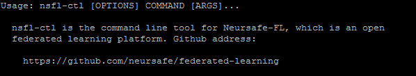

<div align="center">
   
</div>


# Installation 

For scenarios where you only need to quickly experience YanshiShield FL and federated learning, we recommend installing in standalone mode, which allows you to quickly start a federated training. For production environments, cluster mode installation is recommended. The SDK for federated development needs to be installed in both installation modes.


## SDK Installation

### 1. Enter YanshiShield FL code

```shell
cd federated-learning
```


### 2. Install SDK

Install the SDK according to the underlying machine learning framework. By default, both Tensorflow and Pytorch support:

```shell
# for Tensorflow and Pytorch
./deploy/scripts/install_sdk.sh

# for Tensorflow only
./deploy/scripts/install_sdk.sh --runtime=tf

# for Pytorch only
./deploy/scripts/install_sdk.sh --runtime=torch
```

In the Python 3 environment, verify whether the SDK installation is successful.

 


### 3. Install nsfl-ctl

nsfl-ctl is a command line client. Users can use this command to quickly create, delete, and query federated jobs. Run the following commands to install:

```shell
./deploy/scripts/install_cli.sh
```

To verify whether nsfl-ctl is successfully installed, execute the following command, and the comment to the command as shown in the figure below shows that the installation has been successful.

```
nsfl-ctl
```

 

You can add the command parameter --help to view the instructions for using the command


## Standalone Mode

For standalone mode, you can choose to run as host processes or containers. For container mode, no installation is required. See the [quick start](quick_start.md) document for container mode. In this mode, you only need to install the coordinator and client components:


### 1. Install coordinator

```
./deploy/scripts/install_coordinator.sh
```


### 2. Install client

Install the client according to the underlying machine learning framework. By default, both Tensorflow and Pytoch support:

```shell
# for Tensorflow and Pytorch
./deploy/scripts/install_client.sh

# for Tensorflow only
./deploy/scripts/install_client.sh --runtime=tf

# for Pytorch only
./deploy/scripts/install_client.sh --runtime=torch
```


After the installation, please refer to the [quick start](quick_start.md) to experience federated learning.


## Cluster Mode

Please refer to [Cluster Deployment Guide](cluster_deploy.md) to complete the deployment of Neursafe FL.
