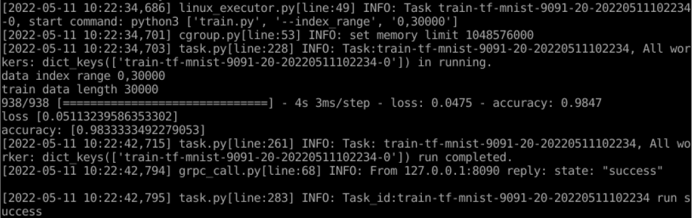
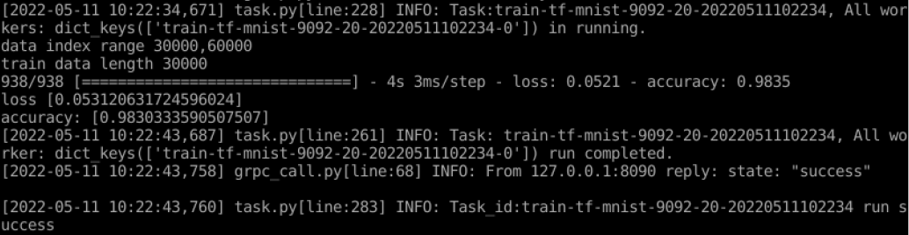
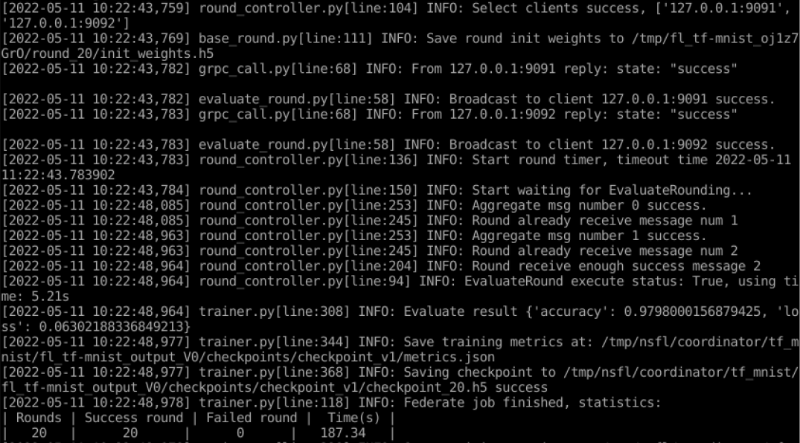
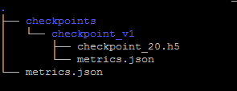

# Quick Start

In this tutorial, we use the classic MNIST training example to introduce how to use Neursafe FL for federated training in standalone mode. Please follow the [building](build.md) and [installation](install.md) instructions to complete the installation of Neursafe FL in standalone scenarios first.


## Prepare dataset

### 1. Enter Neursafe FL code

```shell
cd federated-learning
```


### 2. Create directory for Minist dataset

```shell
mkdir -p /tmp/nsfl
```


### 3. Download MNIST dataset

Download the MNIST dataset according to  the underlying machine learning framework.

```shell
#for tensoflow
python3 example/data/prepare_tf_data.py --path /tmp/nsfl/data/mnist/tf/ --dataset_name mnist

#for pytorch
python3 example/data/prepare_torch_data.py --path /tmp/nsfl/data/mnist/torch/ --dataset_name mnist
```


## Prepare configuration files

Run the following command to generate the configuration for the Coordinator and Clients of the federated learning job:

```shell
python3 example/scripts/gen_config.py --job_name=tf_mnist \
--workspace=/tmp/nsfl/ \
--coordinator_port=8090 \
--client_ports=9091,9092 \
--runtime=tensorflow \
--platform=linux \
--rounds=20 \
--dataset=/tmp/nsfl/data/mnist/tf/mnist.npz
```

Parameter description:：

| parameter name   | must | default    | description                                                  |
| ---------------- | ---- | ---------- | ------------------------------------------------------------ |
| job_name         | Yes  | -          | The name of the federated job. There will be folders for different jobs in the "federated-learning/example/jobs directory". Use the corresponding folder name as the name of the federated job, such as tf_mnist, tf_vgg16, etc. |
| workspace        | Yes  |            | Specify the workspace directory of the federated job to store the configuration files and training scripts required by the federated job and the intermediate data produced in federated training |
| coordinator_port | Yes  | -          | Specify port of the coordinator                              |
| client_ports     | Yes  | -          | Specify multiple client ports separated by ",", how many ports are configured means that how many clients required configuration files will be generated |
| runtime          | No   | tensorflow | Specify the deep learning framework used by the federated job, supporting tensorflow or pytorch |
| platform         | No   | linux      | Specify the running platform of the federated learning job, supports linux (running in local process mode) and k8s (running in cluster mode) |
| rounds           | Yes  | -          | Specify the number of training epochs for federated learning jobs |
| dataset          | No   | None       | Specify the dataset path for federated learning job          |
| data_split       | No   | index      | Split the data by [index, class, drichlet]. The index, data will be evenly divided into each client. The class, data will be divided into each client according to the category. The drichlet, data will be sampled from the drichlet distribution |
| dataset_name     | No   | None       | The dataset name [mnist, cifar10]，it's effective when data_split set drichlet |
| drichlet_arg     | No   | 0.3        | The parameter for drichlet distribution, lower drichlet_arg and higher heterogeneity |
| drichlet_seed    | No   | 20         | The random seed for drichlet distribution. When use same seed, The generated data distribution is the same |
| optionals        | No   | None       | Specify optional configuration items for federated jobs, such as security algorithms, compression algorithms, etc. (refer to [the job configuration guide](apis.md)), and describe dictionary parameters in the form of strings, such as "{'compression':{'type':'quantization','quantization_bits':2}}" (note: the use of ' and ") |

The generated configuration is in the form of json and stored in the location specified by the workspace parameter, as follows:

 


### Dataset configuration description:

The dataset configuration file is named datasets.json, which describes the relationship between dataset name and dataset path, such as:

```json
{
    "mnist": "/datasets/mnist",
    "cifar10": "/datasets/cifar10"
}
```


### Job script configuration description:

Job script configuration, which describes the path of the training script executed by the client, the path of the evaluation script, and the corresponding script parameters, such as:

```json
{
        "script_path": "/workspace/example/scripts/tf_mnist", # Storage paths for training scripts and evaluation scripts
        "train": {
                "timeout": 30,  # Waiting for the timeout time for script execution, if the timeout is still not over, it is considered that the operation failed
                "command": "python3.7", # command executed by the script
                "entry": "train.py", # entry point for script execution
                "params": null # The parameters of script execution, describe the parameters in the form of a dictionary, such as {"--index_range": "0,5000"}
        },
        "evaluate": {
                "timeout": 30,
                "command": "python3.7",
                "entry": "evaluate.py",
                "params": null
        }
}
```

Note: The file name of the job configuration must be the same as the value specified by "task_entry" in the federated job (refer to [Job object description](apsi.md) for its meaning). If the value of "task_entry" in the job is "tf_mnist", then The file name of the job configuration is tf_mnist.json


## Prepare the federated learning script

The Neursafe FL migrate machine learning to federated by adding some API calling in traning  script,  as follows:

- Before loading the training data, call the get_dataset_path interface to obtain the local training data path, as NOTE 1.
- When loading model parameters, use Nerusafe FL's load_weights to replace the original implementation, and load the model parameters delivered from the Coordinator, as  NOTE 2.
- After completing the local training , call commit to report the updated model parameters and metrics(such as accuracy, loss, etc.) to the Coordinator, as  NOTE 3.

```Python
import neursafe_fl as nsfl
from tensorflow import keras as ks
import tensorflow as tf

mnist = tf.keras.datasets.mnist

# [NOTE 1]
data_path = nsfl.get_dataset_path("tf_mnist")
(x_train, y_train), (_, _) = mnist.load_data(data_path)

model = tf.keras.models.Sequential([
tf.keras.layers.Flatten(input_shape=(28, 28)),
tf.keras.layers.Dense(128, activation='relu'),
tf.keras.layers.Dropout(0.2),
tf.keras.layers.Dense(10, activation='softmax')
])

# [NOTE 2]
nsfl.load_weights(model)
history = model.fit(x_train, y_train, epochs=1)
print('loss', history.history['loss'])
print('accuracy:', history.history['accuracy'])

metrics = {
'sample_num': len(x_train),
'loss': history.history['loss'][-1],
'accuracy': history.history['accuracy'][-1]
}

# [NOTE 3]
nsfl.commit(metrics, model)
```

Note: The configuration generation commands in the previous section have automatically generated model training and evaluation scripts


## Run federated learning

Optionally run federated training jobs as  processes or containers.

### Run in process

#### 1. Run first client

```shell
 ./deploy/scripts/run_client.sh /tmp/nsfl/client_0/tf_mnist.json
```

#### 2. Run Second client

```
 ./deploy/scripts/run_client.sh /tmp/nsfl/client_1/tf_mnist.json
```

#### 3. Run Coordinator

```
./deploy/scripts/run_coordinator.sh /tmp/nsfl/coordinator/tf_mnist.json
```


### Run in container

#### 1. Run first client

```shell
docker run -v /tmp/nsfl:/tmp/nsfl --net=host nsfl-client-cpu --config_file /tmp/nsfl/client_0/tf_mnist.json
```

#### 2. Run second client

```sh
docker run -v /tmp/nsfl:/tmp/nsfl --net=host nsfl-client-cpu --config_file /tmp/nsfl/client_1/tf_mnist.json
```

#### 3. Run Coordinator

```shell
docker run -v /tmp/nsfl:/tmp/nsfl --net=host nsfl-coordinator --config_file /tmp/nsfl/coordinator/tf_mnist.json
```


## Federated learning process

After executing the above command, we can see the cooperation process of federated learning in the output of the client and coordinator, as shown below:

### 1. Client 1




### 2. Client 2




### 3. Coordinator




### 4. Result

This example demonstrates that two clients participate in Federated training. After training, the final model and metrics will be saved in directory /tmp/nsfl/coordinator/tf_mnist/fl_tf-mnist_output_V0:



Among them, checkpoint_ 20.h5 is the final model weight after 20 rounds of federated training, metrics.json  records the accuracy, loss and other information of the model.