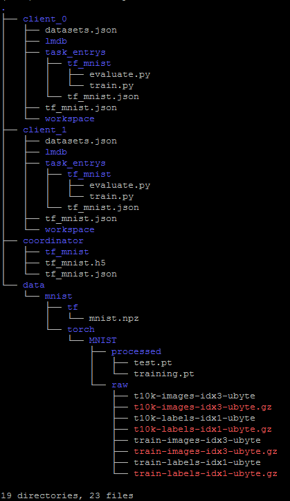

# 快速开始

本文通过Minst演示如何在单机模式下使用Neursafe FL来进行联邦训练，请根据[编译](build_zh.md)、[安装](install_zh.md)指导先完成单机场景下的Neursafe FL的安装


## 准备数据

### 1. 进入Neursafe FL代码库

```shell
cd federated-learning
```


### 2. 创建目录用于存放Minist数据集

```shell
mkdir -p /tmp/nsfl
```


### 3. 下载MNIST数据集

根据底层运行的基础学习框架下载框架自带的默认MNIST数据集

```shell
#for tensoflow
python3 example/data/mnist/prepare_tf_data.py --path /tmp/nsfl/data/mnist/tf/

#for pytorch
python3 example/data/mnist/prepare_torch_data.py --path /tmp/nsfl/data/mnist/torch/
```


## 准备配置文件

运行如下命令，为作业的Coordinator和Clients生成配置：

```shell
python3 example/scripts/gen_mnist_config.py --job_name=tf_mnist \
--workspace=/tmp/nsfl/ \
--coordinator_port=8090 \
--client_ports=9091,9092 \
--runtime=tensorflow \
--platform=linux \
--rounds=5 \
--dataset=/tmp/nsfl/data/mnist/tf/mnist.npz
```

参数意义：

| 参数名           | 描述                                                         |
| ---------------- | ------------------------------------------------------------ |
| workspace        | 指定联邦作业的workspace目录，存放联邦作业需要的配置文件、训练脚本以及联邦训练中产生的中间数据 |
| coordinator_port | 指定coordinator的端口                                        |
| client_ports     | 指定多个client的端口，用“,”隔开，配置多少个端口，就会生成多少个客户端需要的配置 |
| runtime          | 指定联邦作业的使用的深度学习框架，支持tensorflow或pytorch    |
| platform         | 指定联邦作业的运行平台，支持linux（本地进程方式运行）、k8s（集群方式运行） |
| rounds           | 指定联邦作业的训练轮数                                       |
| dataset          | 指定联邦作业训练的数据集地址                                 |

生成的配置以json文件的形式，存在在workspace参数指定的位置，如下：

 


## 准备联邦训练脚本

Neursafe FL通过在原机器学习框架（Tensorflow或Pytorch）的训练脚本中，加入少量联邦学习API来完成模型训练的联邦迁移，如本例所示，具体修改点如下：

- 加载训练数据前，调用get_dataset_path接口获取本地训练数据地址，代码修改参见NOTE 1。
- 加载模型参数时，使用Nerusafe FL的load_weights替换原有模型加载实现，加载从Coordinator下发的模型参数，代码修改参见NOTE 2。
- 完成模型的本地训练后，调用commit_weights向Coordinator上报模型参数更新值，代码修改参见NOTE 3。
- 调用commit_metrics接口，提交联邦训练一些统计数据，例如精度，loss等，代码修改参见NOTE 4。


```Python
import neursafe_fl as nsfl
from tensorflow import keras as ks
import tensorflow as tf

mnist = tf.keras.datasets.mnist

# [NOTE 1]
data_path = nsfl.get_dataset_path("tf_mnist")
(x_train, y_train), (_, _) = mnist.load_data(data_path)

model = tf.keras.models.Sequential([
tf.keras.layers.Flatten(input_shape=(28, 28)),
tf.keras.layers.Dense(128, activation='relu'),
tf.keras.layers.Dropout(0.2),
tf.keras.layers.Dense(10, activation='softmax')
])

# [NOTE 2]
nsfl.load_weights(model)
history = model.fit(x_train, y_train, epochs=1)
print('loss', history.history['loss'])
print('accuracy:', history.history['accuracy'])

# [NOTE 3]
nsfl.commit_weights(model)

metrics = {
'sample_num': len(x_train),
'loss': history.history['loss'][-1],
'accuracy': history.history['accuracy'][-1]
}

# [NOTE 4]
nsfl.commit_metrics(metrics)
```


## 运行联邦学习

可选在主机进程或者容器方式运行联邦训练作业。

### 进程方式运行

#### 1. 运行第一个客户端

```shell
docker run -v /tmp/nsfl:/tmp/nsfl --net=host nsfl-client-cpu --config_file /tmp/nsfl/client_0/tf_mnist.json
```

#### 2. 运行第二个客户端

```
 docker run -v /tmp/nsfl:/tmp/nsfl --net=host nsfl-client-cpu --config_file /tmp/nsfl/client_1/tf_mnist.json
```

#### 3. 运行Coordinator

```
docker run -v /tmp/nsfl:/tmp/nsfl --net=host nsfl-coordinator --config_file /tmp/nsfl/coordinator/tf_mnist.json
```


### 容器方式运行

#### 1. 运行第一个客户端

```shell
docker run -v /tmp/neursafe:/tmp/neursafe --net=host nsfl-client-cpu /tmp/nsfl/client_0/tf_mnist.json
```

#### 2. 运行第二个客户端

```sh
docker run -v /tmp/neursafe:/tmp/neursafe --net=host nsfl-client-cpu /tmp/nsfl/client_1/tf_mnist.json
```

#### 3. 运行Coordinator

```shell
docker run -v /tmp/neursafe:/tmp/neursafe --net=host nsfl-coordinator /tmp/nsfl/coordinator/tf_mnist.json
```


## 联邦训练过程

执行完上述命令后，我们可以在客户端和服务器端Coordinator程序输出看到联邦学习协同训练的过程，如下所示：

### 1. 客户端1


### 2. 客户端2


### 3. Coordinator


