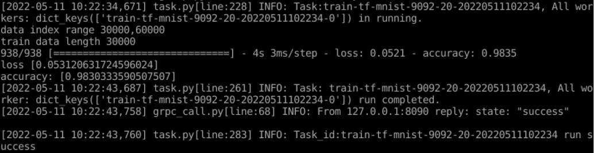

# 快速开始

本文通过Minst演示如何在单机模式下使用Neursafe FL来进行联邦训练，请根据[编译](build_zh.md)、[安装](install_zh.md)指导先完成单机场景下的Neursafe FL的安装


## 准备数据

### 1. 进入Neursafe FL代码库

```shell
cd federated-learning
```


### 2. 创建目录用于存放Minist数据集

```shell
mkdir -p /tmp/nsfl
```


### 3. 下载MNIST数据集

根据底层运行的基础学习框架下载框架自带的默认MNIST数据集

```shell
#for tensoflow
python3 example/data/prepare_tf_data.py --path /tmp/nsfl/data/mnist/tf/ --dataset_name mnist

#for pytorch
python3 example/data/prepare_torch_data.py --path /tmp/nsfl/data/mnist/torch/ --dataset_name mnist
```


## 准备配置文件

运行如下命令，为作业的Coordinator和Clients生成配置：

```shell
python3 example/scripts/gen_config.py --job_name=tf_mnist \
--workspace=/tmp/nsfl/ \
--coordinator_port=8090 \
--client_ports=9091,9092 \
--runtime=tensorflow \
--platform=linux \
--rounds=20 \
--dataset=/tmp/nsfl/data/mnist/tf/mnist.npz
```

参数意义：

| 参数名           | 必须 | 默认值     | 描述                                                         |
| ---------------- | ---- | ---------- | ------------------------------------------------------------ |
| job_name         | 是   | -          | 联邦作业的名称，在federated-learning/example/jobs目录下会有不同作业的文件夹，以对应文件夹名字作为联邦作业的名称，如tf_mnist、tf_vgg16等 |
| workspace        | 是   | -          | 指定联邦作业的workspace目录，存放联邦作业需要的配置文件、训练脚本以及联邦训练中产生的中间数据 |
| coordinator_port | 是   | -          | 指定coordinator的端口                                        |
| client_ports     | 是   | -          | 指定多个client的端口，用“,”隔开，配置多少个端口，就会生成多少个客户端需要的配置 |
| runtime          | 否   | tensorflow | 指定联邦作业的使用的深度学习框架，支持tensorflow或pytorch    |
| platform         | 否   | linux      | 指定联邦作业的运行平台，支持linux（本地进程方式运行）、k8s（集群方式运行） |
| rounds           | 是   | -          | 指定联邦作业的训练轮数                                       |
| dataset          | 否   | None       | 指定联邦作业训练的数据集地址                                 |
| data_split       | 否   | index      | 使用的数据切分方式，有[index,calss,drichlet]三种。当设置为index时，数据按数据索引进行均匀切分，设置为class时，数据是按数据类别分到各个client，设置为drichlet时，数据按drichlet分布取样的方式拆分到各个client |
| dataset_name     | 否   | None       | 使用的数据集名称, [mnist, cifar10]，data_split设置为drichlet有效 |
| drichlet_arg     | 否   | 0.3        | drichlet分布的参数，数值越小，数据越异质                     |
| drichlet_seed    | 否   | 20         | drichlet分布的随机种子，在设置种子相同时，生成的数据分布也相同 |
| optionals        | 否   | None       | 指定联邦作业可选的配置项，如安全算法、压缩算法等（参考[作业配置指导](apis.md)），以字符串的形式描述字典参数，如"{'compression':{'type':'quantization','quantization_bits':2}}"（注意：‘与“的使用） |

生成的配置以json文件的形式，存在在workspace参数指定的位置，如下：

 


### 数据集配置描述：

数据集配置文件命名为datasets.json，描述了数据集名称和数据集路径的关系，如：

```json
{
    "mnist": "/datasets/mnist",
    "cifar10": "/datasets/cifar10"
}
```


### 作业脚本配置描述：

作业脚本配置，描述了客户端执行的训练脚本的路径、评估脚本的路径以及相应的脚本参数，如

```json
{
        "script_path": "/workspace/example/scripts/tf_mnist", # 训练脚本、评估脚本的存储路径
        "train": {
                "timeout": 30,  # 等待脚本执行的超时时间，超时仍未执行结束，认为运行失败
                "command": "python3.7", # 脚本执行的命令
                "entry": "train.py", # 脚本执行的入口
                "params": null # 脚本执行的参数，以字典形式描述参数，如 {"--index_range": "0,5000"}
        },
        "evaluate": {
                "timeout": 30,
                "command": "python3.7",
                "entry": "evaluate.py",
                "params": null
        }
}
```

注意：作业配置的文件名必须和联邦作业中 “ task_entry ”指定的值一样（其含义参考[Job对象的描述](apsi.md)），如job中“task_entry”的值为“tf_mnist"，则作业配置的文件名就是tf_mnist.json


## 准备联邦训练脚本

Neursafe FL通过在原机器学习框架（Tensorflow或Pytorch）的训练脚本中，加入少量联邦学习API来完成模型训练的联邦迁移，如本例所示，具体修改点如下：

- 加载训练数据前，调用get_dataset_path接口获取本地训练数据地址，代码修改参见NOTE 1。
- 加载模型参数时，使用Nerusafe FL的load_weights替换原有模型加载实现，加载从Coordinator下发的模型参数，代码修改参见NOTE 2。
- 完成模型的本地训练后，调用commit向Coordinator上报模型参数更新值以及指标数据（精度，loss等），代码修改参见NOTE 3。

```Python
import neursafe_fl as nsfl
from tensorflow import keras as ks
import tensorflow as tf

mnist = tf.keras.datasets.mnist

# [NOTE 1]
data_path = nsfl.get_dataset_path("tf_mnist")
(x_train, y_train), (_, _) = mnist.load_data(data_path)

model = tf.keras.models.Sequential([
tf.keras.layers.Flatten(input_shape=(28, 28)),
tf.keras.layers.Dense(128, activation='relu'),
tf.keras.layers.Dropout(0.2),
tf.keras.layers.Dense(10, activation='softmax')
])

# [NOTE 2]
nsfl.load_weights(model)
history = model.fit(x_train, y_train, epochs=1)
print('loss', history.history['loss'])
print('accuracy:', history.history['accuracy'])

metrics = {
'sample_num': len(x_train),
'loss': history.history['loss'][-1],
'accuracy': history.history['accuracy'][-1]
}

# [NOTE 3]
nsfl.commit(metrics, model)
```

注意：上一节中的配置生成命令已经自动生成模型训练、评估脚本


## 运行联邦学习

可选在主机进程或者容器方式运行联邦训练作业。

### 进程方式运行

#### 1. 运行第一个客户端

```shell
./deploy/scripts/run_client.sh /tmp/nsfl/client_0/tf_mnist.json
```

#### 2. 运行第二个客户端

```
 ./deploy/scripts/run_client.sh /tmp/nsfl/client_1/tf_mnist.json
```

#### 3. 运行Coordinator

```
./deploy/scripts/run_coordinator.sh /tmp/nsfl/coordinator/tf_mnist.json
```


### 容器方式运行

#### 1. 运行第一个客户端

```shell
docker run -v /tmp/nsfl:/tmp/nsfl --net=host nsfl-client-cpu --config_file /tmp/nsfl/client_0/tf_mnist.json
```

#### 2. 运行第二个客户端

```sh
docker run -v /tmp/nsfl:/tmp/nsfl --net=host nsfl-client-cpu --config_file /tmp/nsfl/client_1/tf_mnist.json
```

#### 3. 运行Coordinator

```shell
docker run -v /tmp/nsfl:/tmp/nsfl --net=host nsfl-coordinator --config_file /tmp/nsfl/coordinator/tf_mnist.json
```


## 联邦训练过程

执行完上述命令后，我们可以在客户端和服务器端Coordinator程序输出看到联邦学习协同训练的过程，如下所示：

### 1. 客户端1


### 2. 客户端2




### 3. Coordinator


### 4. 结果

本example演示了两个客户端参与联邦训练，训练完成后，最终的模型和指标信息会保存在/tmp/nsfl/coordinator/tf_mnist/fl_tf-mnist_output_V0目录下：

 

其中，checkpoint_20.h5是20轮联邦训练后最终的模型权重，metrics.json记录了模型的accuracy、loss等信息。