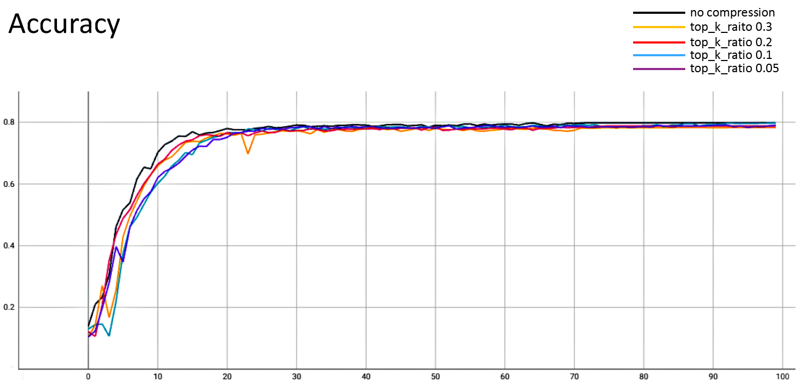
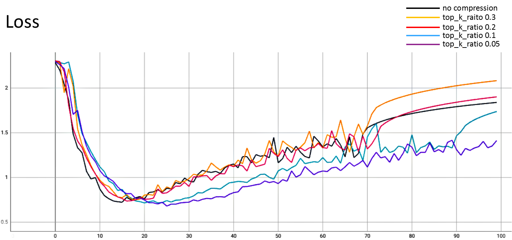
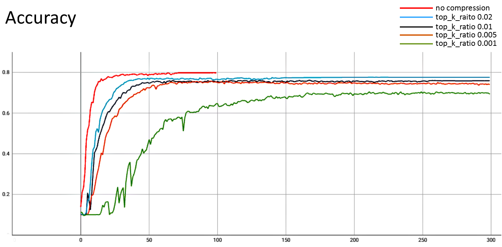
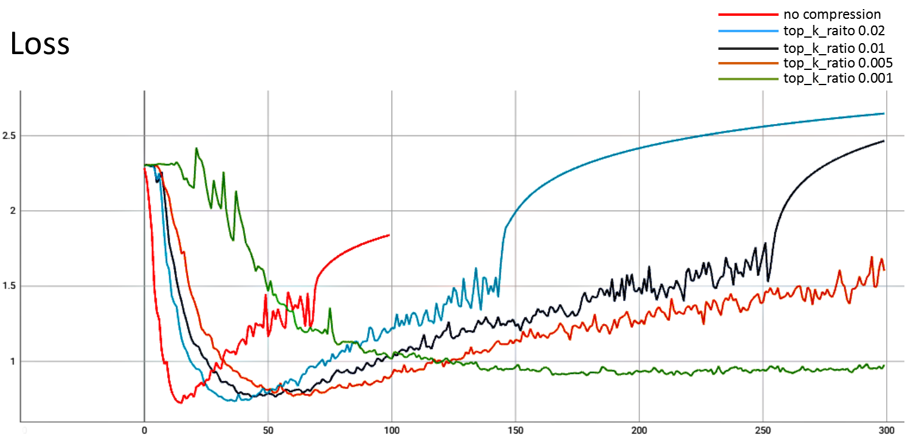
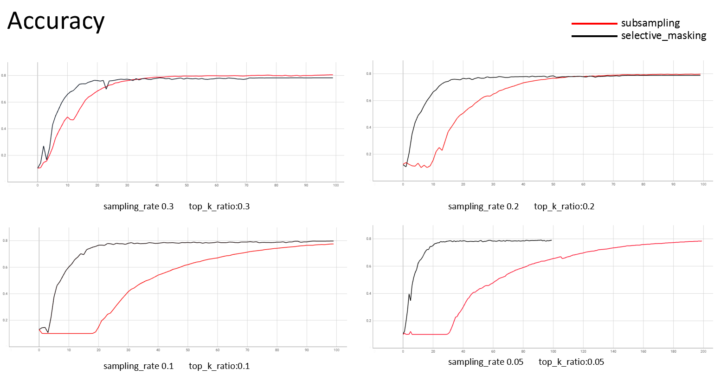
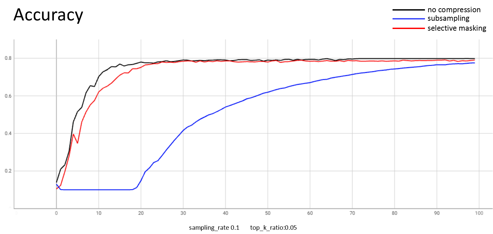

# Selective masking compression


## Introduction

For the background introduction of the compression algorithm and experiment preparation, please refer to the [guidance document](../README.md). This article mainly introduces the theory of selective masking compression, how to use it and the experimental summary.


## Theory

Suppose the updated weights are $W_t=(w^1,..., w^n)$, which represents the updated weights of  the $t$-th round of federated training, the model has $n$ layers, and the weight of the $i$-th layer is $w^i$, the shape of $w^i$ is $d_1$x$d_2$, The specific steps of selective masking compression are as follows：

1. First,  we flatten one layer of delta weights(updated weights) and select top K largest absolute difference value according to sampling ratio(top_k_ratio), it means that the value k equal sampling ratio multiplied with the number of elements of the layer of delta weights .At the same time, we will also extract the indexes of these k values in the array, for example:

   $$original\ weight\ of\ one\ layer: [[1.0,\ 2.0],\ [3.0,\ 4.0]]$$

   $$flatten\ above\ weight: [1.0,\ 2.0,\ 3.0,\ 4.0]$$

   $$top\\_k\\_ratio: 0.5$$

   $$chosen\ values: [3.0,\ 4.0]$$

   $$indexes\ of\ chosen\ values: [2,\ 3]$$

2. Then clients send selected values, indexes of selected values and shape of raw shape to coordinator.

3. After the coordinator receives the above values, restore updated weight. Of course, the recovery weight is lossy, for example:

   $$chosen\ values: [3.0,\ 4.0]$$

   $$indexes\ of\ chosen\ values: [2,\ 3]$$

   $$restore\ flattened\ weight: [0.0,\ 0.0,\ 3.0,\ 4.0]$$

   $$shape\ of\ raw\ weight: (2, 2)$$

   $$restored\ weight: [[0.0,\ 0.0], [3.0,\ 4.0]]$$

By analogy, the client compresses all layers of the weight by selective masking, and then uploads it to the coordinator, and the coordinator restores the weights and aggregates them.


## Experiment

- Run the following command to generate the configuration for the Coordinator and Clients of the federated training:

  ```shell
  python3 example/scripts/gen_config.py \
  --job_name=tf_vgg16 \
  --workspace=/tmp/nsfl/compression \
  --coordinator_port=8090 \
  --client_ports=9091,9092 \
  --runtime=tensorflow \
  --platform=linux \
  --rounds=100 \
  --optionals="{'compression':{'type':'selective_masking','top_k_ratio':0.05}}"
  ```

  Note：

  1. Refer to the description of script parameters in the chapter "Prepare configuration files" in [Quick Start](../../../docs/quick_start.md) to configure the "optionals" item.
  2. Refer to [Job Configuration Guide](../../../docs/apis.md), configure the compression algorithm in "optionals", such as top_k_ratio is 0.1, 0.05, etc.

- Run first Client:

  ```shell
  nvidia-docker run --net host -v /tmp/nsfl/compression:/tmp/nsfl/compression -v ~/.keras/datasets:/root/.keras/datasets nsfl-client-gpu --config_file /tmp/nsfl/compression/client_0/tf_vgg16.json
  ```


- Run second Client:

  ```shell
  nvidia-docker run --net host -v /tmp/nsfl/compression:/tmp/nsfl/compression -v ~/.keras/datasets:/root/.keras/datasets nsfl-client-gpu --config_file /tmp/nsfl/compression/client_0/tf_vgg16.json
  ```


- Run Coordinator to start federated training:

  ```
  docker run --net host -v /tmp/nsfl/compression:/tmp/nsfl/compression nsfl-coordinator --config_file /tmp/nsfl/compression/coordinator/tf_vgg16.json
  ```


## Conclusion

The experiments performed federated training of top_k_ratio which is 0.3, 0.2, 0.1, 0.05, 0.02, 0.01, 0.005, 0.001 respectively. Since subsampling and selective masking are similar, we also compared the convergence of two different compression algorithms. 

First, we tested the federated training when top_k_ratio was 0.3, 0.2, 0.1 and 0.05 respectively. The convergence curves are summarized as follows:







The above experiments are summarized as follows:

| top_k_ratio | updated weights size(M) | compression ratio | accuracy |
| ----------- | ----------------------- | ----------------- | -------- |
| None        | 128.32                  | 1                 | 0.798    |
| 0.3         | 86.13                   | almost 67%        | 0.7828   |
| 0.2         | 57.43                   | almost 45%        | 0.7884   |
| 0.1         | 28.72                   | almost 22%        | 0.7976   |
| 0.05        | 14.36                   | almost 11%        | 0.7905   |


From the experimental data, it can be seen that the smaller the top_k_ratio, the lower the compression rate, but it can be found that the compression rate is a little more than twice the top_k_ratio value, mainly because the transmitted data not only contains the selected data, but also contains the corresponding indexes of these data. The convergence performance of the selective masking compression algorithm is very good. It can be seen that its convergence trend is almost the same as the uncompressed convergence trend, and the final convergence result is almost the same

Then we tested the federated training when top_k_ratio was 0.02, 0.01, 0.005 and 0.001 respectively. This set of tests makes the compression rate smaller, and we test the performance of convergence efficiency and convergence results in the case of extreme compression. The convergence results are summarized as follows:







The above experiments are summarized as follows:

| top_k_ratio | updated weights size(M) | compression ratio | accuracy |
| ----------- | ----------------------- | ----------------- | -------- |
| None        | 128.32                  | 1                 | 0.798    |
| 0.02        | 5.75                    | almost 4.5%       | 0.7761   |
| 0.01        | 2.87                    | almost 2.2%       | 0.7589   |
| 0.005       | 1.44                    | almost 1.1%       | 0.7407   |
| 0.001       | 0.31                    | almost 0.24%      | 0.6932   |

At very low compression ratios situation, the convergence rate is slowed down, and the convergence accuracy suffers because very few effective weight updates are extracted. Although when top_k_ratio is 0.001, the convergence accuracy and convergence rate are relatively greatly affected, but the convergence efficiency and convergence results of other parameters are not greatly affected, and the communication overhead will be greatly reduced.


Since the theory of subsampling and selective masking are similar, we compared the two algorithms.






The above experiments are summarized as follows:

| Algorithm         | top_k_ratio | sampling rate | updated weights size(M) | compression ratio | round | accuracy |
| ----------------- | ----------- | ------------- | ----------------------- | ----------------- | ----- | -------- |
| subsampling       | -           | 0.3           | 38.48                   | almost 30%        | 100   | 0.806    |
| subsampling       | -           | 0.2           | 25.66                   | almost 20%        | 100   | 0.7974   |
| subsampling       | -           | 0.1           | 19.25                   | almost 10%        | 100   | 0.7755   |
| subsampling       | -           | 0.05          | 12.83                   | almost 5%         | 200   | 0.7841   |
| selective_masking | 0.3         | -             | 86.13                   | almost 67%        | 100   | 0.7828   |
| selective_masking | 0.2         | -             | 57.43                   | almost 45%        | 100   | 0.7884   |
| selective_masking | 0.1         | -             | 28.72                   | almost 22%        | 100   | 0.7976   |
| selective_masking | 0.05        | -             | 14.36                   | almost 11%        | 100   | 0.7905   |

From the above experimental data, we can find that the convergence rate of selective masking algorithm is much better than subsampling algorithm. Although the actual compression rate of the selective masking algorithm is higher than subsampling algorithm, even if the actual compression rate is same, the convergence efficiency of selective masking algorithm  is still far superior to subsampling algorithm, and the lower the compression rate, the higher the efficiency of the selective masking algorithm. Therefore, we suggest that when using the selective masking algorithm, a lower top_k_ratio can be appropriately selected to reduce communication overhead.

