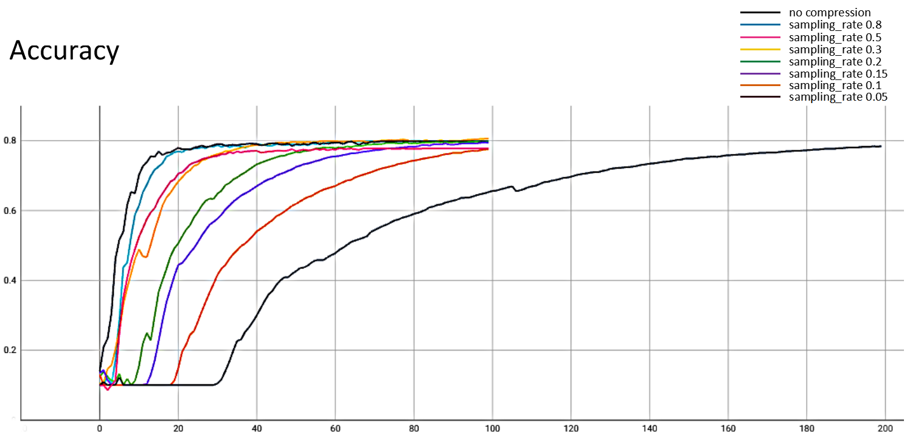
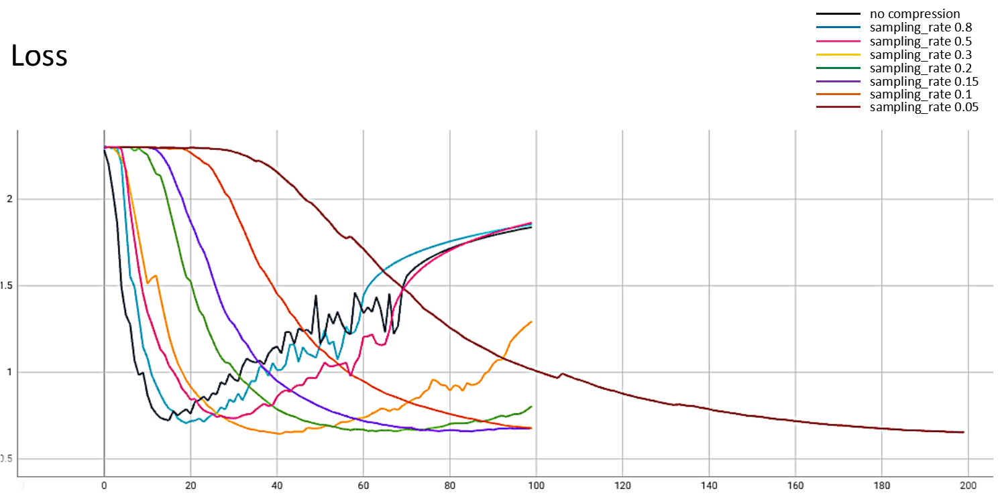

# Subsampling compression

## Introduction

For the background introduction of the compression algorithm and experiment preparation, please refer to the [guidance document](../README.md). This article mainly introduces the theory of subsampling compression, how to use it and the experimental summary.


## Theory

Suppose the updated weights are $W_t=(w^1,..., w^n)$, which represents the updated weights of  the $t$-th round of federated training, the model has $n$ layers, and the weight of the $i$-th layer is $w^i$, the shape of $w^i$ is $d_1$x$d_2$, The specific steps of subsampling compression are as follows：

1. First, we generate a seed and generate a random 0,1 mask matrix according to the shape, in which the proportion of 0 is the same as the set parameter sampling_rate, because 0 means to be reserved, 1 means it will be masked.

2. According to the mask matrix, extract the weight value that needs to be uploaded to the coordinator from the original weight, for example:

   $$original\ weight: [[1, 2], [3, 4]]$$

   $$mask\ matrix: [[0, 1], [1, 0]]$$

   $$masked\ weight: [1, 3]$$

3. The coordinator receives the masked weight and the reported seed, first generates the same 0,1 mask matrix, then restores the reported weight to the shape of the original matrix according to the mask matrix, and fills the masked value with 0.0, for example:

   $$masked\ weight: [1, 3]$$

   $$mask\ matrix: [[0, 1], [1, 0]]$$

   $$original\ weight: [[1, 0], [3, 0]]$$

By analogy, the client compresses all layers of the weight by sub-sampling, and then uploads it to the coordinator, and the coordinator restores the weights and aggregates them.


## Experiment

- Run the following command to generate the configuration for the Coordinator and Clients of the federated training:

  ```shell
  python3 example/scripts/gen_config.py \
  --job_name=tf_vgg16 \
  --workspace=/tmp/nsfl/compression \
  --coordinator_port=8090 \
  --client_ports=9091,9092 \
  --runtime=tensorflow \
  --platform=linux \
  --rounds=100 \
  --optionals="{'compression':{'type':'subsampling','sampling_rate':0.6}}"
  ```

  Note：

  1. Refer to the description of script parameters in the chapter "Prepare configuration files" in [Quick Start](../../../docs/quick_start.md) to configure the "optionals" item.
  2. Refer to [Job Configuration Guide](../../../docs/apis.md), configure the compression algorithm in "optionals", such as sampling_rate is 0.2, 0.5, 0.8, etc.

- Run first Client:

  ```shell
  nvidia-docker run --net host -v /tmp/nsfl/compression:/tmp/nsfl/compression -v ~/.keras/datasets:/root/.keras/datasets nsfl-client-gpu --config_file /tmp/nsfl/compression/client_0/tf_vgg16.json
  ```


- Run second Client:

  ```shell
  nvidia-docker run --net host -v /tmp/nsfl/compression:/tmp/nsfl/compression -v ~/.keras/datasets:/root/.keras/datasets nsfl-client-gpu --config_file /tmp/nsfl/compression/client_0/tf_vgg16.json
  ```


- Run Coordinator to start federated training:

  ```
  docker run --net host -v /tmp/nsfl/compression:/tmp/nsfl/compression nsfl-coordinator --config_file /tmp/nsfl/compression/coordinator/tf_vgg16.json
  ```


## Conclusion

The experiments performed federated training of sampling rate which is 0.8, 0.5, 0.3, 0.2, 0.15, 0.1, 0.05 respectively, and the convergence curves were summarized as follows:







The above experiments are summarized as follows:

| sampling rate | updated weights size(M) | compression ratio | accuracy |
| ------------- | ----------------------- | ----------------- | -------- |
| None          | 128.32                  | 1                 | 0.798    |
| 0.8           | 102.68                  | almost 80%        | 0.7992   |
| 0.5           | 64.15                   | almost 50%        | 0.7778   |
| 0.3           | 38.48                   | almost 30%        | 0.806    |
| 0.2           | 25.66                   | almost 20%        | 0.7974   |
| 0.15          | 19.25                   | almost 15%        | 0.7938   |
| 0.1           | 12.83                   | almost 10%        | 0.7755   |
| 0.05          | 6.42                    | almost 5%         | 0.7841   |

It can be seen from the experimental data that the sampling_rate becomes smaller, the compression ratio and the compressed weights are smaller. As the compression rate decreases, the convergence rate becomes slower, because the effective updated weights are less, which affects convergence efficiency, but the convergence results are not significantly affected. However, when the sampling rate is 0.05, although the transmission weight is significantly reduced, more training rounds are required to converge, but the overall transmission volume is still significantly reduced. Of course, as the number of training rounds increases, additional training overhead is required, so you need to consider comprehensively and select appropriate parameters. Therefore, sampling can effectively reduce the communication overhead and improve the performance of federated learning without affecting the convergence results.

