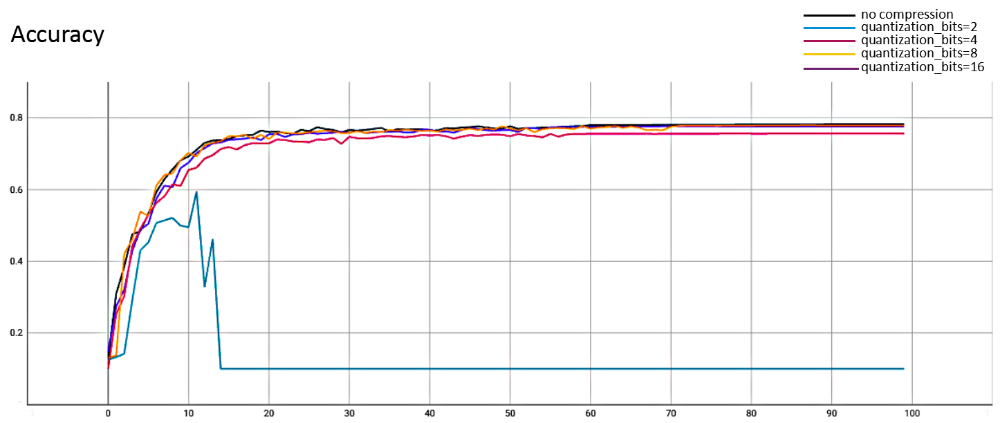
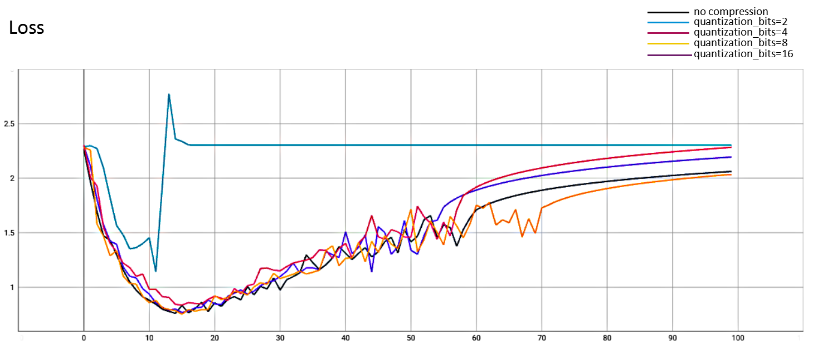

# Compression

## Background

In the whole training process of federated learning, after each round of training, each client needs to upload the delta weights to the Coordinator. The communication overhead will lead to relatively low efficiency of federated training. Therefore, compressing the transmitted data will effectively improve the efficiency of federated training. This paper introduces the theory and usage of the relevant compression algorithms, as well as the relevant experiments to compare and verify the feasibility of the compression algorithms.


## Test environmental preparation

The experiments in this paper are based on CIFAR10 dataset and VGG16 model, two federated clients participate in federated training, and the sample data for federated training is split according to the IID method. In order to compare the convergence efficiency, we set the client to perform only one epoch iteration per round.

All experiments are executed in local for algorithm verification. For the generation of configuration scripts related to federated training, please refer to the chapter "Prepare configuration files" in [Quick Start](../../../docs/quick_start.md).


## Algorithms summary

### Baseline

First, we perform federated training without compression, and use this convergence curve as a baseline for comparison with other compression algorithms to verify the difference in convergence efficiency and convergence performance of federated training.

- #### Experiment

  - Run the following command to generate the configuration for the Coordinator and Clients of the federated training:

    ```shell
    python3 example/scripts/gen_config.py \
    --job_name=tf_vgg16
    --workspace=/tmp/nsfl/compression \
    --coordinator_port=8090 \
    --client_ports=9091,9092 \
    --runtime=tensorflow \
    --platform=linux \
    --rounds=20
    ```

    

  - Run first Client:

    ```shell
    nvidia-docker run --net host -v /tmp/nsfl/compression:/tmp/nsfl/compression -v ~/.keras/datasets:/root/.keras/datasets nsfl-client-gpu --config_file /tmp/nsfl/compression/client_0/tf_vgg16.json
    ```

    

  - Run second Client:

    ```shell
    nvidia-docker run --net host -v /tmp/nsfl/compression:/tmp/nsfl/compression -v ~/.keras/datasets:/root/.keras/datasets nsfl-client-gpu --config_file /tmp/nsfl/compression/client_0/tf_vgg16.json
    ```

    

  - Run Coordinator to start federated training:

    ```
    docker run --net host -v /tmp/nsfl/compression:/tmp/nsfl/compression nsfl-coordinator --config_file /tmp/nsfl/compression/coordinator/tf_vgg16.json
    ```

  

  Note：

  1. You can also refer to the "Run federated learning" chapter in [Quick Start](../../../docs/quick_start.md) to execute in process.
  2. Since the official cifar10 dataset of tensorflow does not provide a way to load from the local path, and the directory of the dataset cache is ~/.keras/datasets, so we mount this directory into the container to avoid repeated downloading of the dataset.

  

### Quantization compression

- #### Theory

  Suppose the updated weights are $W_t=(w^1,..., w^n)$, which represents the updated weights of  the $t$-th round of federated training, the model has $n$ layers, and the weight of the $i$-th layer is $w^i$, where $w_\max^i=max(w^i)$, $w_\min^i=min(w^i)$; According to the value of quantization_bits in the quantization compression algorithm configuration (that is, the bit length $b$-bit that needs to be quantized), we equally divide $[w_\max^i, w_\min^i]$ into $2^b$ intervals; Suppose that the value $w_j^i$ of the $j$-th element in the $i$-th layer weight falls in the interval boundary $h_\min$ and $h_\max$, We use rounding to replace $w_j^i$ with $h_\min$ or $h_\max$, The specific steps of quantization compression are as follows：

  1. According to the bit length $b$-bit to be quantized, quantize $w^i$ according to the following formula：
     $$\hat w^i=round((w^i - min(w^i)) / (max(w^i) - min(w^i)) * (2^b - 1))$$
     
  2. $\hat w^i$ is compressed by packing the integer array into integer numbers by bits, as shown below：
     $$[00, 10, 01, 11] -> [[11100100]] -> [[228]]$$
  
The client sends the updated weights after quantization compression to the Coordinator, and the Coordinator restores the weights according to the reverse operation of the compression.
  
- #### Experiment

  - Run the following command to generate the configuration for the Coordinator and Clients of the federated training:

    ```shell
    python3 example/scripts/gen_config.py \
    --job_name=tf_vgg16 \
    --workspace=/tmp/nsfl/compression \
    --coordinator_port=8090 \
    --client_ports=9091,9092 \
    --runtime=tensorflow \
    --platform=linux \
    --rounds=20
    --optionals="{'compression':{'type':'quantization','quantization_bits':2}}"
    ```

    Note：

    1. Refer to the description of script parameters in the chapter "Prepare configuration files" in [Quick Start](../../../docs/quick_start.md) to configure the "optionals" item.
    2. Refer to [Job Configuration Guide](../../../docs/apis.md), configure the compression algorithm in "optionals", such as quantization_bits is 2, 4, 8, etc.

    

  - Refer to the above command to run the Clients and Coordinator.

  

- #### Conclusion

  The experiments performed federated training of 2-bit compression, 4-bit compression, 8-bit compression, and 16-bit compression respectively, and the convergence curves were summarized as follows:

  

  

  

  We pack the integer array into the integer number(type: int32) by bits, and int32 is represented by 4Byte (bit length is 32). The compression ratio can be calculated according to the bit length of the quantization compression. 

  The above experiments are summarized as follows:
  
  | compression bit length | updated weights size(M) | compression ratio | accuracy |
  | ---------------------- | ----------------------- | ----------------- | -------- |
  | None                   | 128.32                  | 1                 | 0.7822   |
  | 2                      | 8.28                    | almost 1/16       | 0.1      |
  | 4                      | 16.56                   | almost 1/8        | 0.7566   |
  | 8                      | 33.12                   | almost 1/4        | 0.7791   |
  | 16                     | 66.23                   | almost 1/2        | 0.7763   |

  
  
  From the experimental data, we can see that in the federated learning of 2-bit quantization compression, it cannot converge in the end, other quantization compression experiments can converge; For 2-bit quantization compression, although the compression effect is the best, but excessive compression leads to data distortion and affects model converges. As long as an appropriate quantization compression bit length is configured, the introduction of quantization compression has almost no effect on the convergence speed and convergence performance of federated learning, but the transmission overhead of updated weights are significantly reduced; So quantization compression can effectively improve the performance of federated learning.


